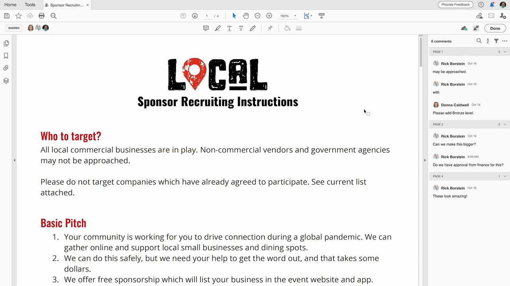
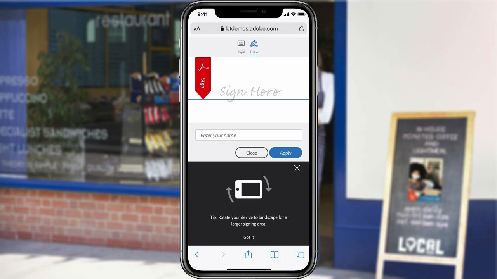
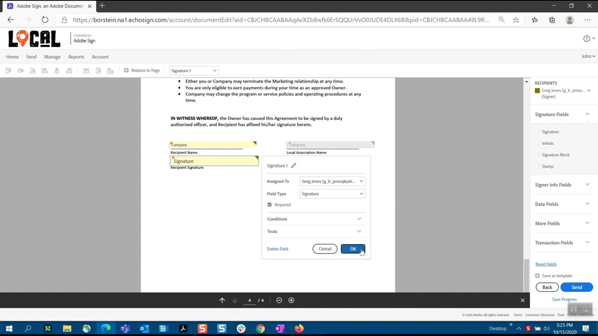
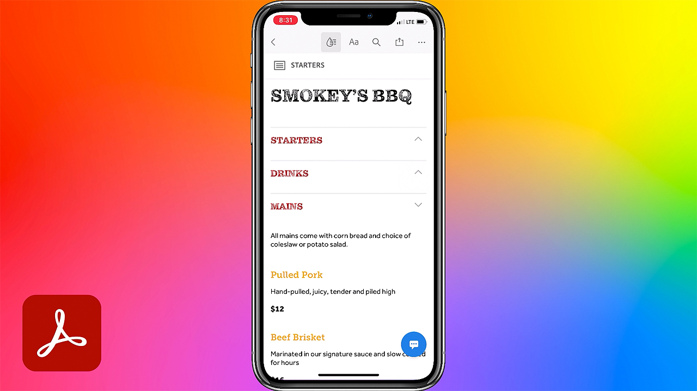
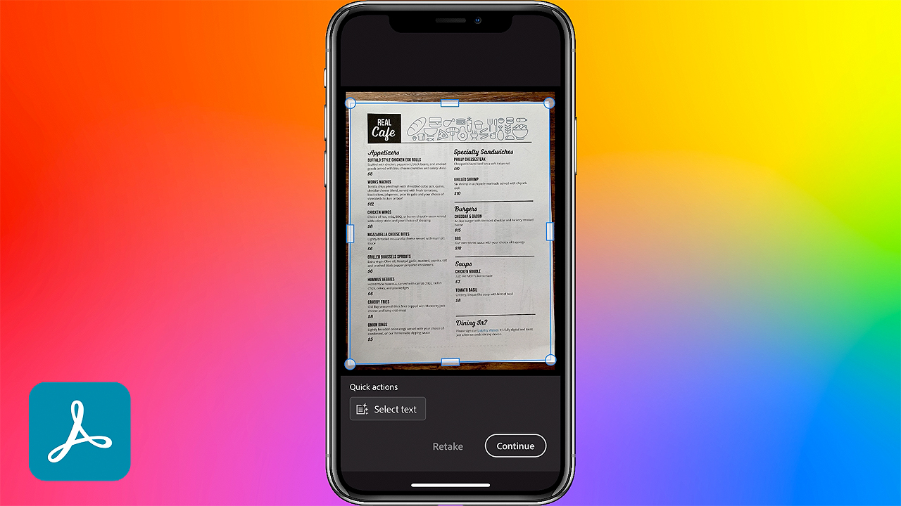

# Acrobat och Sign

Med Adobe Document Cloud - som har världsledande PDF och elektroniska signaturer - kan man förvandla manuella dokumentprocesser till effektiva digitala. Nu kan teamet snabbt åtgärda dokument, arbetsflöden och uppgifter - på flera skärmar och enheter - var som helst, när som helst och i dina Microsoft- och företagsprogram.

## Bläddra i Tutorials

<table style="table-layout:fixed">
<tr>
 <td>
   
    

   <a href="acrobat-sign.md#tutorial1"><strong>Starta en delad granskning i Acrobat</strong></a>
    

    <em>Bjud in granskare att lägga till sina kommentarer i ett PDF-dokument</em>
     
  </td>
  <td>
    
    

    <a href="acrobat-sign.md#tutorial2"><strong>Skapa Forms med Adobe Sign online</strong></a>
    

    <em>Förvandla snabbt dokument till onlineformulär och publicera dem online där alla som behöver dem kan fylla i och signera dem</em>
     
  </td>
  <td>
   
    

    <a href="acrobat-sign.md#tutorial3"><strong>Begär en signatur med Adobe Sign</strong></a>
    

    <em>Gå från Word till PDF och skicka för signering med Adobe Sign</em>
     
  </td>
</tr>
<tr>
 <td>
   
    

   <a href="acrobat-sign.md#tutorial4"><strong>Visa menyer på mobilen med Liquid Mode</strong></a>
    

    <em>Använd Liquid Mode för att förbättra läsarupplevelsen av PDF på mobila enheter</em>
     
  </td>
  <td>
    
    

    <a href="acrobat-sign.md#tutorial5"><strong>Skanna dokument till PDF från din mobiltelefon</strong></a>
    

    <em>Med Adobe Scan kan du enkelt hämta in och konvertera dokument, formulär, visitkort och whiteboardtavlor till högkvalitativa Adobe PDF</em>
     
  </td>
  <td>
    
    

     
  </td>
</tr>
</table>

## Starta en delad granskning med Acrobat (3:49) {#tutorial1}

>[!VIDEO](https://video.tv.adobe.com/v/326777?hidetitle=true)

**Beskrivning**
Bjud in granskare att lägga till sina kommentarer i ett PDF-dokument.

I den här självstudiekursen får du lära dig hur du:
* Värd PDF kommenterar i Document Cloud
* Samla kommentarer på ett och samma ställe
* Samtidiga kommentarer uppmuntrar till samarbete

**Adobe Review and Comment Options Comparison PDF**

**Presenteras av:**
Dan Armstrong, lösningskonsult (digitala medier) Rick Borstein, Senior Manager Solution Consulting (Digital Media)

## Skapa Forms med Adobe Sign (5:19) online {#tutorial2}

>[!VIDEO](https://video.tv.adobe.com/v/326776?hidetitle=true)

**Beskrivning**
Förvandla snabbt dokument till onlineformulär och publicera dem online där alla som behöver dem kan fylla i och signera dem.

I den här självstudiekursen får du lära dig hur du:
* Digitalisera pappersblanketter genom att omvandla dem till digitala dokument
* Skicka digitala formulär till webbplatsen där kunderna kan komma åt dem från sin egen enhet
* Ifyllda blanketter arkiveras automatiskt

**Presenteras av:**
Taylor Kobey, lösningskonsult (digitala medier) Emily Palmer, lösningskonsult (digitala medier)

## Begär en signatur med Adobe Sign (3:21) {#tutorial3}

>[!VIDEO](https://video.tv.adobe.com/v/326801?hidetitle=true)

**Beskrivning**
Gå från Word till PDF och skicka för signering med Adobe Sign.

I den här självstudiekursen får du lära dig hur du:
* Utnyttja de verktyg du använder varje dag för att skicka digitala dokument för signering

**Presenteras av:**
Rick Borstein, Senior Manager Solution Consulting (Digital Media)

## Visa menyer på mobila enheter med Liquid Mode (2:57) {#tutorial4}

>[!VIDEO](https://video.tv.adobe.com/v/327093?hidetitle=true)

**Beskrivning**
Använd Liquid Mode för att förbättra läsarupplevelsen av PDF på mobila enheter.

I den här självstudiekursen får du lära dig hur du:
* Gör PDF-filer responsiva för mobila enheter
* Förbättra PDF-layouten
* Lägg till funktioner i farten så att du enkelt kan läsa dokument på telefonen eller surfplattan

**Presenteras av:**
Emilie Enke, Associate Solutions Consultant (Digital Media)

## Skanna dokument till PDF från din mobiltelefon (5:53) {#tutorial5}

>[!VIDEO](https://video.tv.adobe.com/v/327094?hidetitle=true)

**Beskrivning**
Med Adobe Scan kan du enkelt hämta in och konvertera dokument, formulär, visitkort och whiteboardtavlor till högkvalitativa Adobe PDF.

I den här självstudiekursen får du lära dig hur du:
* Använd mobiltelefonen för att hämta in och konvertera dokument, formulär, visitkort och whiteboardtavlor till högkvalitativa Adobe PDF
* Identifiera och öka skärpan i handskriven eller utskriven text automatiskt, samtidigt som du tar bort element som du inte vill ha, som bländning och skugga
* Öppna det skannade PDF i Acrobat Reader för att göra anteckningar och kommentarer och granska med ditt team

**Presenteras av:**
Emilie Enke, Associate Solutions Consultant (Digital Media)

**Resurser för Acrobat och Adobe Sign**

[Utbildning och support](https://helpx.adobe.com/support/document-cloud.html) är ditt nav för ytterligare självstudiekurser, [Nyheter](https://helpx.adobe.com/acrobat/using/whats-new.html)och länkar till användarforum.

**Oktober 2020-utgåvan**

Börja använda dessa funktioner (och mycket mer!) genom att hämta den senaste uppdateringen från Creative Cloud-datorprogrammet.
