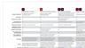

# Acrobat &amp; Sign

Med Adobe Document Cloud - som innehåller världens ledande lösningar för PDF och elektroniska signaturer - kan man omvandla manuella dokumentprocesser till effektiva digitala. Nu kan teamet vidta snabba åtgärder för dokument, arbetsflöden och uppgifter - på flera skärmar och enheter - var som helst, när som helst och inuti dina favoritprogram från Microsoft och Enterprise.

## Bläddra i Tutorials Produkt

<table style="table-layout:fixed">
<tr>
 <td>
   
    

   <a href="acrobat-sign.md#tutorial1"><strong>Starta en delad Acrobat-granskning</strong></a>
    

    <em>Bjud in granskare att lägga in sina kommentarer i ett PDF-dokument</em>
     
  </td>
  <td>
    
    

    <a href="acrobat-sign.md#tutorial2"><strong>Skapa Forms för onlineundantag med Adobe Sign</strong></a>
    

    <em>Omvandla snabbt dokument till onlineformulär och lägg upp dem online där alla som behöver dem kan fylla i och signera dem</em>
     
  </td>
  <td>
   
    

    <a href="acrobat-sign.md#tutorial3"><strong>Begär en signatur med Adobe Sign</strong></a>
    

    <em>Gå från Word till PDF och skicka för signering med Adobe Sign</em>
     
  </td>
</tr>
<tr>
 <td>
   
    

   <a href="acrobat-sign.md#tutorial4"><strong>Visa menyer på mobilen med flytande läge</strong></a>
    

    <em>Använd Flytande läge för att förbättra läsarupplevelsen av PDF-filer på mobila enheter</em>
     
  </td>
  <td>
    
    

    <a href="acrobat-sign.md#tutorial5"><strong>Skanna dokument till PDF-filer från mobiltelefonen</strong></a>
    

    <em>Med Adobe Scan kan du enkelt konvertera dokument, formulär, visitkort och whiteboardtavlor till högkvalitativa PDF-filer i Adobe</em>
     
  </td>
  <td>
    
    

     
  </td>
</tr>
</table>

## Starta en delad Acrobat-granskning (3:49) {#tutorial1}

>[!VIDEO](https://video.tv.adobe.com/v/326777?hidetitle=true)

****
BeskrivningBjud in granskare att lägga in sina kommentarer i ett PDF-dokument.

I den här självstudiekursen får du lära dig att:
* Lägg in PDF-kommentarer i Document Cloud
* Samla in kommentarer på ett och samma ställe
* Samtidiga kommentarer uppmuntrar samarbete

**Jämförelse av gransknings- och kommentaralternativ i Adobe PDF**

**Presenteras av:**
Dan Armstrong, Solutions Consultant (Digital Media) Rick Borstein, Senior Manager Solution Consulting (Digital Media)

## Skapa Forms för onlineundantag med Adobe Sign (5:19) {#tutorial2}

>[!VIDEO](https://video.tv.adobe.com/v/326776?hidetitle=true)

****
BeskrivningKonvertera snabbt dokument till onlineformulär och lägg upp dem online där alla som behöver dem kan fylla i och signera dem.

I den här självstudiekursen får du lära dig att:
* digitalisera genom att omvandla pappersblanketter till digitala dokument
* Lägg upp digitala formulär på webbplatsen där kunderna kan komma åt dem från sin egen enhet
* Färdiga formulär arkiveras automatiskt för dina register

**Presenteras av:**
Taylor Kobey, Solutions Consultant (Digital Media) Emily Palmer, Solutions Consultant (Digital Media)

## Begär en signatur med Adobe Sign (3:21) {#tutorial3}

>[!VIDEO](https://video.tv.adobe.com/v/326801?hidetitle=true)

****
BeskrivningGå från Word till PDF och skicka för signering med Adobe Sign.

I den här självstudiekursen får du lära dig att:
* Utnyttja de verktyg du använder varje dag för att skicka digitala dokument för underskrift

**Presenteras av:**
Rick Borstein, Senior Manager Solution Consulting (Digital Media)

## Visa menyer på mobilen med flytande läge (2:57) {#tutorial4}

>[!VIDEO](https://video.tv.adobe.com/v/327093?hidetitle=true)

****
BeskrivningAnvänd flytande läge för att förbättra läsarupplevelsen av PDF-filer på mobila enheter.

I den här självstudiekursen får du lära dig att:
* Göra PDF-filer responsiva för mobila enheter
* Förbättra PDF-layouten
* Lägg till funktioner direkt så att du enkelt kan läsa dokument på mobilen och surfplattan

**Presenterad av:**
Emilie Enke, Associate Solutions Consultant (Digital Media)

## Skanna dokument till PDF-filer från mobiltelefonen (5:53) {#tutorial5}

>[!VIDEO](https://video.tv.adobe.com/v/327094?hidetitle=true)

****
BeskrivningMed Adobe Scan kan du enkelt konvertera dokument, formulär, visitkort och whiteboardtavlor till högkvalitativa PDF-filer i Adobe.

I den här självstudiekursen får du lära dig att:
* Använd mobiltelefonen för att konvertera dokument, formulär, visitkort och whiteboardtavlor till högkvalitativa PDF-filer i Adobe
* Identifiera och skärp automatiskt handskriven eller utskriven text och ta bort element du inte vill ha, som bläck och skugga
* Öppna den skannade PDF-filen i Acrobat Reader för att göra anteckningar och kommentarer och granska med teamet

**Presenterad av:**
Emilie Enke, Associate Solutions Consultant (Digital Media)

**Acrobat &amp; Adobe Sign Resources**

[Lär dig mer och ](https://helpx.adobe.com/support/document-cloud.html) Support om du vill ha fler självstudiekurser,  [nyheter](https://helpx.adobe.com/acrobat/using/whats-new.html) och länkar till användarforum.

**Oktober 2020-versionen**

Börja använda dessa funktioner (och mycket mer!) genom att hämta den senaste uppdateringen från Creative Cloud-datorprogrammet.
