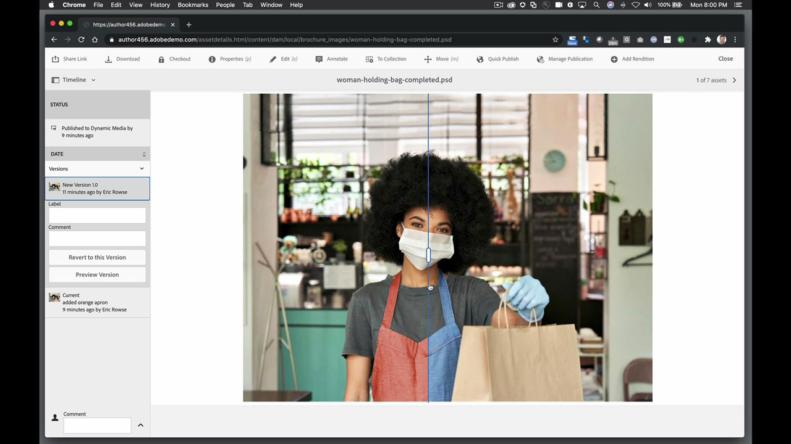
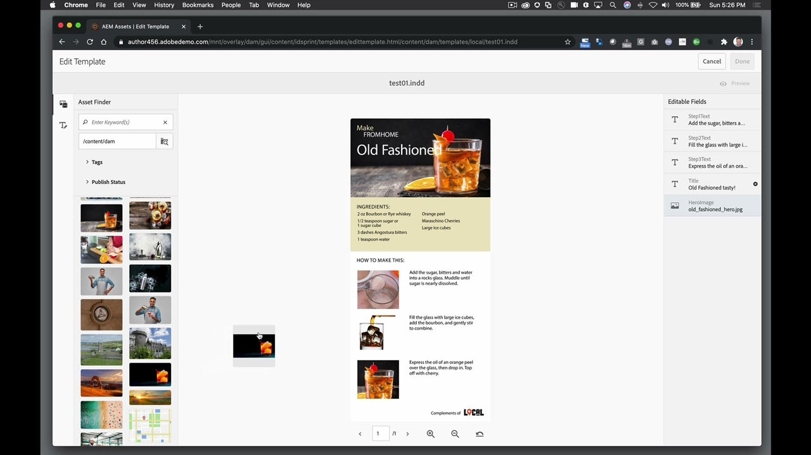
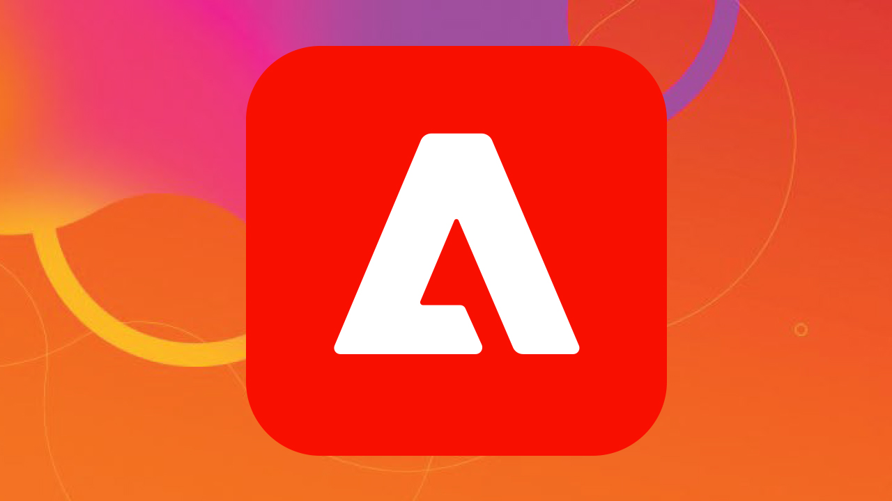

# AEM Assets and Asset Link

Adobe Experience Manager är den branschledande lösningen för hantering av digitala upplevelser för företag och medelstora organisationer. Det utgör en modern, skalbar grund för att leverera övertygande upplevelser som främjar varumärkesengagemang, driver efterfrågan och ökar kundlojaliteten. Experience Manager har en komplett uppsättning verktyg för att skapa, hantera och leverera digitala upplevelser i alla kanaler.

## Bläddra i Tutorials Produkt

<table style="table-layout:fixed">
<tr>
 <td>
   
    

   <a href="aem.md#tutorial1"><strong>AEM- och resurslänk</strong></a>
    

    <em>Göra realtidsuppdateringar av resurser som lagras i AEM med Asset Link</em>
     
  </td>
   <td>
   
    

   <a href="aem.md#tutorial2"><strong>InDesign-filer i AEM</strong></a>
    

    <em>Lägg ditt InDesign-dokument i AEM så att flera användare kan skapa olika varianter samtidigt</em>
     
  </td>
  <td>
    
    

     
  </td>
</tr>
</table>

## AEM och tillgångslänk (5:45) {#tutorial1}

>[!VIDEO](https://video.tv.adobe.com/v/326828?hidetitle=true)

****
BeskrivningUppdatera resurser i realtid i AEM med Asset Link.

I den här självstudiekursen får du lära dig att:
* Hitta det du behöver när du behöver det via en särskild panel för att söka efter och bläddra bland resurser i dina designprogram
* Ladda enkelt upp material direkt från designprogrammen
* Checka ut och checka in resurser från DAM i ditt designprogram för att göra uppdateringar i realtid

**Presenteras av:**
Eric Rowse, Senior Solutions Consultant (Digital Media)

## Filer i InDesign som lagras i AEM (3:16) {#tutorial2}

>[!VIDEO](https://video.tv.adobe.com/v/326829?hidetitle=true)

****
BeskrivningLägg ditt InDesign-dokument i AEM så att flera användare kan skapa innehållsvarianter samtidigt.

I den här självstudiekursen får du lära dig att:
* Överför InDesign-fil till AEM för gemensam lagringsåtkomst
* Skapa tryggt varianter utan att oroa dig för att förstöra källfilen
* Dokumentfält är förformaterade för snabba redigeringar eller innehållsändringar

**Presenteras av:**
Eric Rowse, Senior Solutions Consultant (Digital Media)

<table style="table-layout:fixed">
<tr>
 <td>
   
    

   <a href="https://www.adobe.com/marketing/experience-manager.html"><strong>Adobe Experience Manager</strong></a>
    

    <em>En kraftfull kombination för ditt innehåll och digitala resurshanteringsbehov</em>
     
  </td>
  <td>
   
    

   <a href="https://www.adobe.com/marketing/experience-manager-assets.html"><strong>AEM Assets</strong></a>
    

    <em>Nästa generation av hantering av digitala resurser</em>
     
  </td>
  <td>
   
    

   <a href="https://www.adobe.com/marketing/experience-manager-assets/benefits.html"><strong>AEM Assets: Fördelar</strong></a>
    

    <em>Få dina digitala resurser att fungera</em>
     
  </td>
</tr>
</table>

**Resurslänk och AEM resurser**

[Lär dig mer och ](https://helpx.adobe.com/support/experience-manager.html) support för fler självstudiekurser, nyheter och länkar till communityforum.

**Oktober 2020-versionen**

Börja använda dessa funktioner (och mycket mer!) genom att hämta den senaste uppdateringen från Creative Cloud-datorprogrammet.
