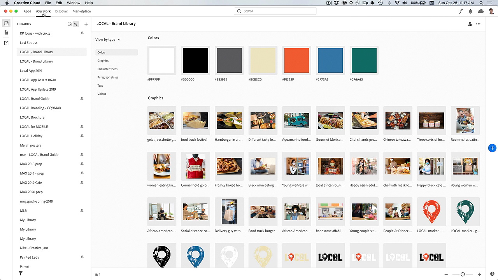

# Creative Cloud-datorprogram

Creative Cloud-datorprogrammet är navet för att hantera CC-program, CC-tjänster och CC-samarbete - och mycket mer!

## Bläddra i Tutorials

<table style="table-layout:fixed">
<tr>
 <td>
   
    

   <a href="creativeclouddesktopapp.md#tutorial1"><strong>Utforska CC-datorprogrammet: Ditt nav för Creative Cloud</strong></a>
    

    <em>Creative Cloud-datorprogrammet är navet för att hantera CC-program, CC-tjänster och CC-samarbete - och mycket mer!</em>
     
  </td>
  <td>
    
    

     
  </td>
  <td>
    
    

     
  </td>
</tr>
</table>

## Utforska CC-datorprogrammet: Ditt nav för Creative Cloud (2:50) {#tutorial1}

>[!VIDEO](https://video.tv.adobe.com/v/327095?hidetitle=true)

**Beskrivning**
Creative Cloud-datorprogrammet är navet för att hantera CC-program, CC-tjänster och CC-samarbete - och mycket mer!

I den här självstudiekursen får du lära dig hur du:
* Starta och uppdatera datorprogram
* Hitta mobil- och webbappar
* Hantera och dela resurser
* Åtkomst till Adobe Fonts
* Upptäck självstudiekurser
* Dela dina verk på Behance

**Presenteras av:**
Patti Sokol, Principal Solutions Consultant (Digital Media)
