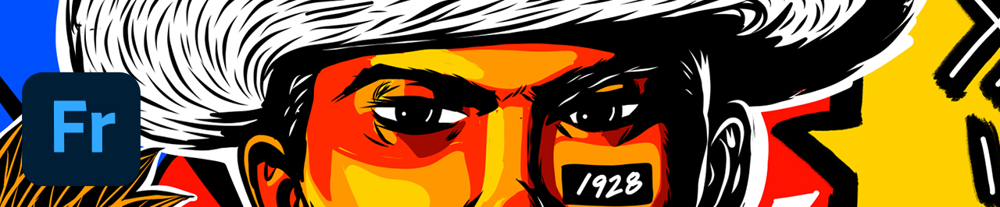
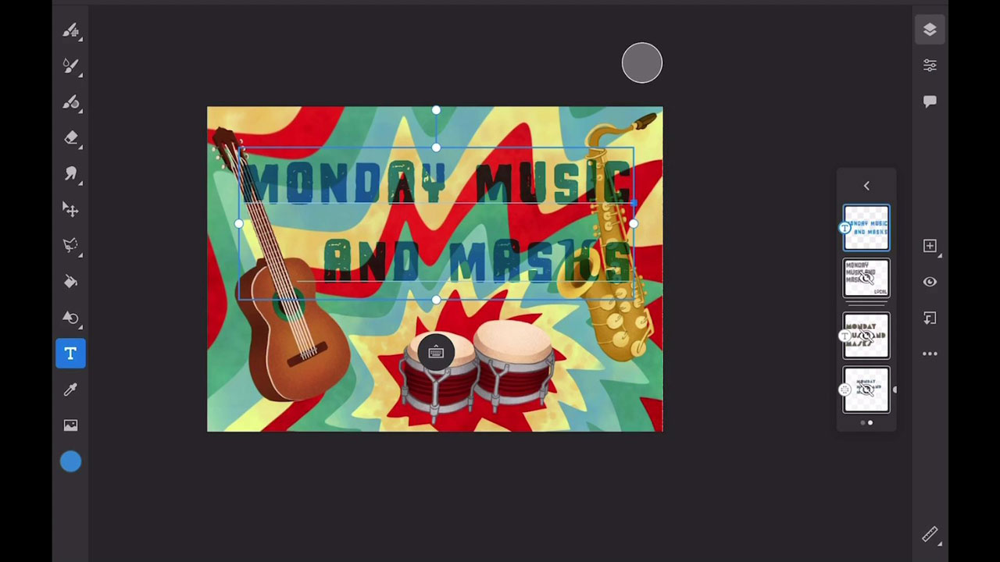
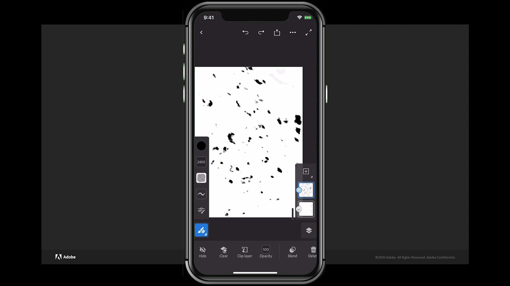

# Fresco

Adobe Fresco är ett plattformsoberoende program för att skapa teckningar och målningar med penselbaserade metoder som kombinerar vektor- och rasterarbetsflöden med molndokument.

## Bläddra i Tutorials

<table style="table-layout:fixed">
<tr>
 <td>
   
    

   <a href="fresco.md#tutorial1"><strong>Introduktion till ritning med Adobe Fresco</strong></a>
    

    <em>Använd de kraftfulla markerings- och färgredigeringsverktygen i Adobe Fresco för att dramatiskt ändra en bild efter företagets grafiska profil</em>
     
  </td>
  <td>
   
    

   <a href="fresco.md#tutorial2"><strong>Skapa texturerade bilder - Fresco till Illustrator</strong></a>
    

    <em>Måla och rita texturer i Adobe Fresco och lär dig använda dem i Illustrator</em>
     
  </td>
  <td>
    
    

     
  </td>
</tr>
</table>

## Introduktion till Rita med Adobe Fresco (19:07) {#tutorial1}

>[!VIDEO](https://video.tv.adobe.com/v/326946?hidetitle=true)

**Beskrivning**
Upptäck Adobe Fresco för att skapa teckningar och målningar med penselbaserade metoder som kombinerar vektor- och rasterarbetsflöden med molndokument.

I den här självstudiekursen får du lära dig hur du:
* Använd unika live-penslar som efterliknar akvarell- och oljefärg tillsammans med dina favoritpixel- och vektorpenslar
* Skapa texturerade effekter genom att lägga olika penslar i lager och använda masker
* Skapa var som helst med den nya Fresco-appen för iPhone
* Exportera arbetet till olika format för användning i andra mobil- och datorprogram

**Presenteras av:**
Liz Tanonis, lösningskonsult (Digital Media)

## Skapa texturerade bilder - Fresco till Illustrator (4:10) {#tutorial2}

>[!VIDEO](https://video.tv.adobe.com/v/326947?hidetitle=true)

**Beskrivning**
Måla och rita texturer i Adobe Fresco och lär dig använda dem i Illustrator.

I den här självstudiekursen får du lära dig hur du:
* Skapa grafik i Adobe Fresco-appen för iPhone och exportera den för användning i andra Creative Cloud-appar
* Använd verktyget Bildkalkering i Illustrator för att konvertera teckningar till vektorer
* Använd handgjorda texturer på vektorbilder i Illustrator

**Presenteras av:**
Liz Tanonis, lösningskonsult (Digital Media)

**Resurser i Fresco**

[Utbildning och support](https://helpx.adobe.com/support/adobe-fresco.html) är ditt nav för ytterligare självstudiekurser, [Nyheter](https://helpx.adobe.com/fresco/using/whats-new.html)och länkar till användarforum.

**Oktober 2020-utgåvan**

Börja använda dessa funktioner (och mycket mer!) genom att hämta den senaste uppdateringen från Creative Cloud-datorprogrammet.
