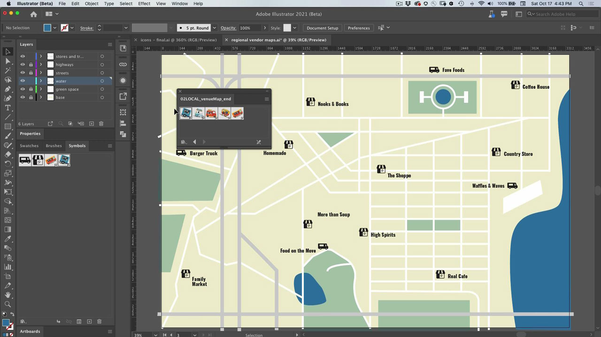
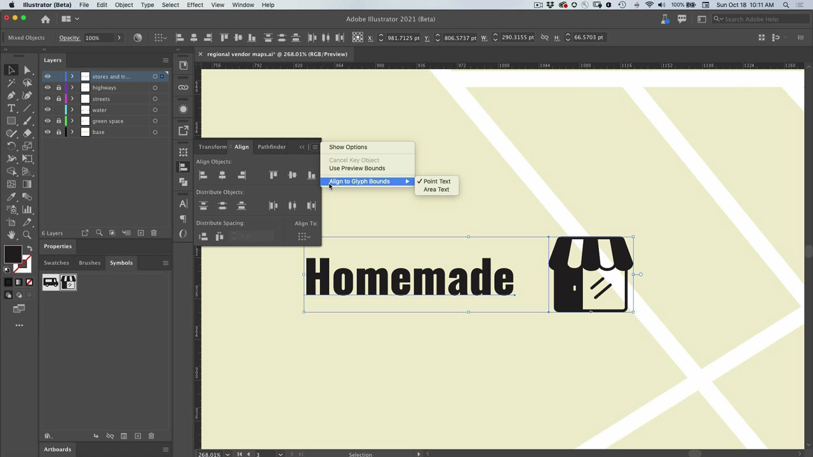

# Illustrator

Det moderna programmet för illustrationer och grafik. Skapa logotyper, ikoner, illustrationer och annat material du kan tänka dig för webben, mobiler och tryck.

## Bläddra i Tutorials Produkt

<table style="table-layout:fixed">
<tr>
 <td>
   
    

   <a href="illustrator.md#tutorial1"><strong>Använd symboler för att uppdatera flera ikoninstanser</strong></a>
    

    <em>Minska det manuella arbetet och bibehåll enhetligheten med symboler</em>
     
  </td>
  <td>
    
    

    <a href="illustrator.md#tutorial2"><strong>Justera text och bilder med Fäst mot tecken</strong></a>
    

    <em>Fäst snabbt tecken på viktiga delar av dokumentet</em>
     
  </td>
  <td>
    
    

     
  </td>
</tr>
</table>

## Använd symboler för att uppdatera flera ikoninstanser (5:08) {#tutorial1}

>[!VIDEO](https://video.tv.adobe.com/v/326816?hidetitle=true)

****
BeskrivningMinska det manuella arbetet och bibehåll enhetligheten med symboler.

I den här självstudiekursen får du lära dig att:
* Minska det manuella arbetet och bibehåll enhetligheten med symboler

**Presenteras av:**
Patti Sokol, Principal Solutions Consultant (Digital Media)

## Justera text och bilder med Fäst mot tecken (6:48) {#tutorial2}

>[!VIDEO](https://video.tv.adobe.com/v/326817?hidetitle=true)

****
BeskrivningFäst snabbt tecken mot viktiga delar av dokumentet.

I den här självstudiekursen får du lära dig att:
* Fäst snabbt tecken på viktiga delar av dokumentet

**Presenteras av:**
Patti Sokol, Principal Solutions Consultant (Digital Media)

**Illustrator Resources**

[Lär dig mer och ](https://helpx.adobe.com/support/illustrator.html) support för fler självstudiekurser och länkar till användarforum.

**Oktober 2020-versionen**

Börja använda dessa funktioner (och mycket mer!) genom att hämta den senaste uppdateringen från Creative Cloud-datorprogrammet.
