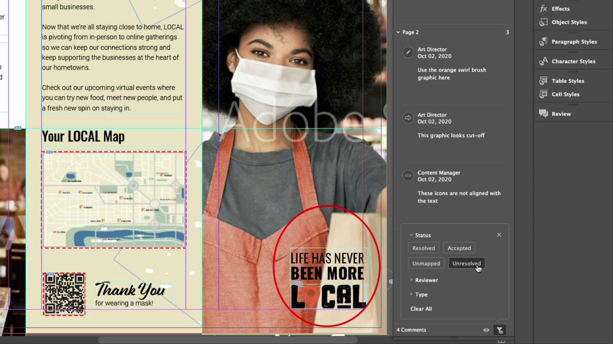

# InDesign

Det branschledande programmet för att skapa snygga dokument för tryck och digital publicering. Skapa engagerande digitala upplevelser och trycksaker, från e-böcker och elektroniska tidskrifter till böcker, rapporter och rapporter.

## Bläddra i Tutorials Produkt

<table style="table-layout:fixed">
<tr>
 <td>
    
    

    <a href="indesign.md#tutorial1"><strong>Generera QR-koder</strong></a>
    

    <em>Generera QR-kod som länkar till en webbplats</em>
     
  </td>
  <td>
   
    

   <a href="indesign.md#tutorial2"><strong>Dela för granskning från InDesign</strong></a>
    

    <em>Smidig kreativ granskning för designers och deras teammedlemmar</em>
     
  </td>
  <td>
    
    

    <a href="indesign.md#tutorial3"><strong>Importera PDF-kommentarer från en Document Cloud-granskning</strong></a>
    

    <em>Importera kommentarer från en PDF direkt till InDesign och lägg snabbt in begärda ändringar</em>
     
  </td>
</tr>
<tr>
<td>
   
    

   <a href="indesign.md#tutorial4"><strong>Lägg till videofil i InDesign-dokument</strong></a>
    

    <em>Lägg till video i InDesign. Utdata till PDF och publicera online</em>
     
  </td>
 <td>
    
    

     
 </td>
 <td>
    
    

     
 </td>
</tr>
</table>

## Generera QR-koder (2:34) {#tutorial1}

>[!VIDEO](https://video.tv.adobe.com/v/326818?hidetitle=true)

****
BeskrivningGenerera QR-kod som länkar till en webbplats.

I den här självstudiekursen får du lära dig mer om:
* Ge åtkomst till webbmaterial via mobila enheter utan att behöva lämna in uppgifter
* Gör kunderna trygga
* Digitalt innebär att det är enkelt att hålla innehållet uppdaterat

**Presenteras av:**
Patti Sokol, Principal Solutions Consultant (Digital Media)

## Dela för granskning från InDesign (4:04) {#tutorial2}

>[!VIDEO](https://video.tv.adobe.com/v/326824?hidetitle=true)

****
BeskrivningInDesign Share for Review ger en ännu smidigare kreativ granskningsupplevelse för designers och deras teammedlemmar.

I den här självstudiekursen får du lära dig att:
* Starta en granskning direkt från InDesign utan att behöva skapa en PDF-fil
* Granska och kommentera från en webbläsare
* Samla in feedback från olika intressenter på ett och samma ställe
* Hantera feedback i appen där ändringar kan göras direkt.

**Jämförelse av gransknings- och kommentaralternativ i Adobe PDF**

**Presenteras av:**
Emily Palmer, Solutions Consultant (Digital Media)

## Importera PDF-kommentarer från en Document Cloud-granskning (4:52) {#tutorial3}

>[!VIDEO](https://video.tv.adobe.com/v/326959?hidetitle=true)

****
BeskrivningImportera kommentarer från en PDF direkt till InDesign och lägg snabbt in begärda ändringar.

I den här självstudiekursen får du lära dig att:
* Stöd för befintliga arbetsflöden för PDF-kommentarer
* Fungerar för PDF-filer som kombineras från flera källor

**Jämförelse av gransknings- och kommentaralternativ i Adobe PDF**

**Presenteras av:**
Michael Murphy, Senior Solutions Consultant (Digital Media)

## Lägg till videofil i InDesign-dokument (5:58) {#tutorial4}

>[!VIDEO](https://video.tv.adobe.com/v/326757?hidetitle=true)

****
BeskrivningLägg till video i InDesign. Skapa PDF och publicera online.

I den här självstudiekursen får du lära dig att:
* Lägg till video i InDesign
* Skapa PDF och publicera online

**Presenteras av:**
Patti Sokol, Principal Solutions Consultant (Digital Media)

**Resurser för InDesign**

[Lär dig mer och ](https://helpx.adobe.com/support/indesign.html) Support om du vill ha fler självstudiekurser,  [nyheter](https://helpx.adobe.com/indesign/user-guide.html/indesign/using/whats-new.ug.html) och länkar till användarforum.

**Oktober 2020-versionen**

Börja använda dessa funktioner (och mycket mer!) genom att hämta den senaste uppdateringen från Creative Cloud-datorprogrammet.
