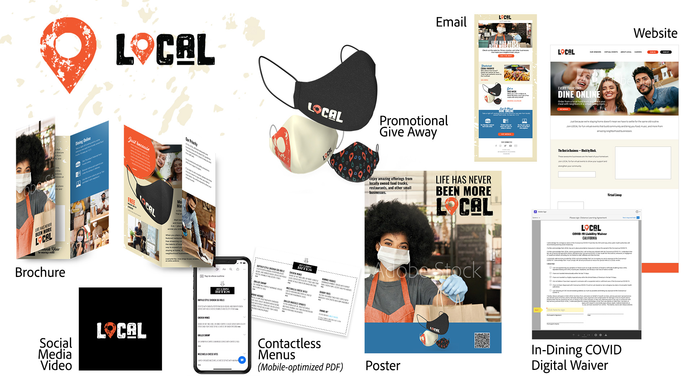

# MAX 2020 - Enterprise-sessionerna

Som kreatör i ett företag måste du samarbeta med distribuerade team, upprätta skalbara processer och följa företagets system och riktlinjer. Dessa självstudiekurser hjälper dig att lära dig nya funktioner i 2021-versionen av Creative Cloud - ur ett företagsperspektiv.

## Utnyttja kraften i AEM Assets och InDesign Server (26:54)

>[!VIDEO](https://video.tv.adobe.com/v/327112?hidetitle=true)

**Beskrivning**

Lägger din kreativa personal för mycket tid på manuellt, repetitivt arbete? Hjälp organisationen att få ut det mesta av kreatörer. Företagssystem som AEM och InDesign Server kan ge både kreatörer och produktionspersonal möjlighet att snabbt överföra innehåll till målgruppen.

I den här inspelade livesessionen visas exempel på mallbaserade arbetsflöden i:
* Adobe Experience Manager (AEM) Assets är en DAM-lösning (Digital Asset Management) som kan integreras med Adobe Creative Cloud så att DAM-användare kan samarbeta med kreatörer och effektivisera samarbetet när material skapas
* Adobe InDesign Server är en layout- och kompositionsmotor som driver automatiserade publiceringslösningar genom att integreras i andra system

**Presenteras av:**

Eric Rowse, Senior Solutions Consultant (Digital Media) Derek Lu, Principal Solutions Consultant (Proof of Concept)

## Nya verktyg för det nya normala (29:57)

>[!VIDEO](https://video.tv.adobe.com/v/328232?hidetitle=true)

**Beskrivning**

WFH har medfört utmaningar, men har också tvingat kreatörer och deras företag att experimentera med nya verktyg och nya sätt att skapa. Utforska välbekanta verktyg som Illustrator och Photoshop i de nya iPad-versionerna och rita med Fresco på surfplattor (iPad, Microsoft Surface) och nu på iPhone!

I den här inspelade livesessionen får du lära dig hur du:
* Använd olika penslar och skuggningstekniker i Fresco för att skapa handritade kampanjbilder
* Skapa och dela nödställda ikoner i Illustrator på iPad för att matcha varumärket
* Skapa material för sociala medier från Fresco och Illustrator på iPad, oavsett var du är med Photoshop på iPad

**Presenteras av:**

Dave Weinberg, Senior Solutions Consultant (Digital Media) Liz Tanonis, Solutions Consultant (Digital Media) Emilie Enke, Solutions Consultant (Digital Media)

## Samarbete med CC Libraries (27:58)

>[!VIDEO](https://video.tv.adobe.com/v/328199?hidetitle=true)

**Beskrivning**

Med Adobe Creative Cloud Libraries kan du hantera, ordna och få tillgång till dina logotyper, färger och annat direkt från dina Creative Cloud-favoritprogram. Arbeta effektivare, skapa enhetlig design och håll dig enkelt uppdaterad med teamet.

I den här självstudiekursen får du lära dig hur du:
* Hitta enkelt de resurser du behöver i alla dina kreativa program
* Gör det möjligt för kommunikatörer i hela organisationen att skapa varumärkesupplevelser samtidigt som de behåller kontrollen

**Presenteras av:**

Ashley Dvorin, Senior Solutions Consultant (Digital Media) Emily Palmer, Solutions Consultant (Digital Media)

## Om demomediefilerna: LOKAL

Teamet började skapa demomediefiler som ett företag skulle kunna göra. Vi planerade en kampanj och skapade resurser för olika kanaler. Vi har också skapat ett CC-bibliotek med varumärkeselement för att stödja samarbete och enhetlighet.

Som svar på covid-19 har LOCAL, ett företag som är värd för live-evenemang som firar roliga, galna semestrar, valt att delta i online-sammankomster och samarbetar med små, lokala livsmedelstruckar och restauranger för att marknadsföra sina företag - och hjälpa dem att hålla öppet.

