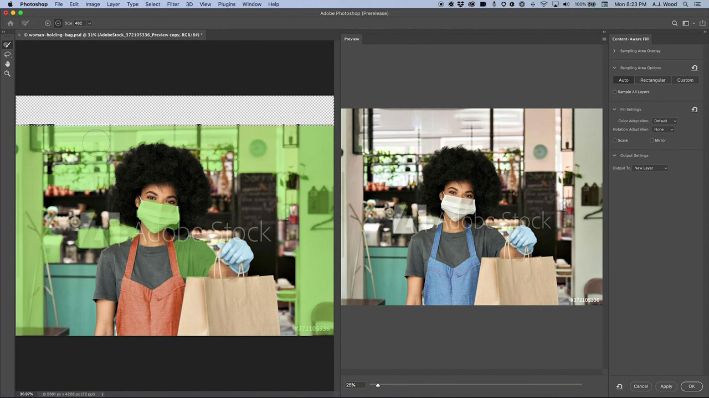
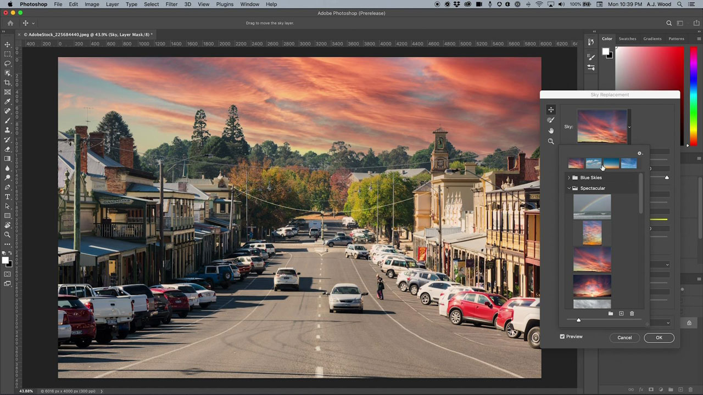

# Photoshop

Photoshop är världens bästa program för bildbehandling och grafisk design, vilket ger obegränsad kreativitet för proffs i alla slags enheter. Nu kan vem som helst skapa vad de vill, var inspirationen än slår till. Om du kan tänka dig det kan du klara det med Photoshop.

## Bläddra i Tutorials Produkt

<table style="table-layout:fixed">
<tr>
 <td>
   
    

   <a href="photoshop.md#tutorial1"><strong>Redigera bilder för att matcha din kampanj</strong></a>
    

    <em>Använd de kraftfulla markerings- och färgredigeringsverktygen i Adobe Photoshop för att dramatiskt ändra en bild efter företagets grafiska profil</em>
     
  </td>
  <td>
    
    

    <a href="photoshop.md#tutorial2"><strong>Markera och ersätt himlen</strong></a>
    

    <em>Markera himlen i en bild automatiskt och ersätt den med en himmel som du väljer. Justera automatiskt färgerna i bilden så att de matchar dina markeringar</em>
     
  </td>
  <td>
    
    

     
  </td>
</tr>
</table>

## Redigera bilder för att matcha kampanjen (5:45) {#tutorial1}

>[!VIDEO](https://video.tv.adobe.com/v/326950?hidetitle=true)

****
BeskrivningAnvänd de kraftfulla markerings- och färgredigeringsverktygen i Adobe Photoshop för att dramatiskt ändra en bild efter företagets grafiska profil.

I den här självstudiekursen får du lära dig att:
* Med objektmarkeringsverktyget kan du markera objekt snabbare och enklare
* Innehållsmedveten fyllning ger bättre kontroll över provområden i en källbild för bättre kloning och lagning av målområden
* Penslar kan ha olika former för bättre resultat
* Adobe Sensei utnyttjar artificiell intelligens för många arbetsuppgifter

**Presenteras av:**
A.J Wood, Senior Solutions Consultant (Digital Media)

## Markera och ersätta himlen (2:16) {#tutorial2}

>[!VIDEO](https://video.tv.adobe.com/v/326953?hidetitle=true)

****
BeskrivningMarkera himlen i en bild automatiskt och ersätt den med en himmel som du väljer. Justera automatiskt färgerna i bilden så att de matchar dina markeringar.

I den här självstudiekursen får du lära dig att:
* Sky Replacement är en lösning med ett klick som du kan använda till att direkt byta himmel i dina bilder
* Sky Replacement sparar utdata som en lagergrupp med varje mask, justering och bild för ytterligare finjustering

**Presenteras av:**
A.J Wood, Senior Solutions Consultant (Digital Media)

**Photoshop Resources**

[Lär dig mer och ](https://helpx.adobe.com/support/photoshop.html) Support om du vill ha fler självstudiekurser,  [nyheter](https://helpx.adobe.com/photoshop/using/whats-new.html) och länkar till användarforum.

**Oktober 2020-versionen**

Börja använda dessa funktioner (och mycket mer!) genom att hämta den senaste uppdateringen från Creative Cloud-datorprogrammet.
