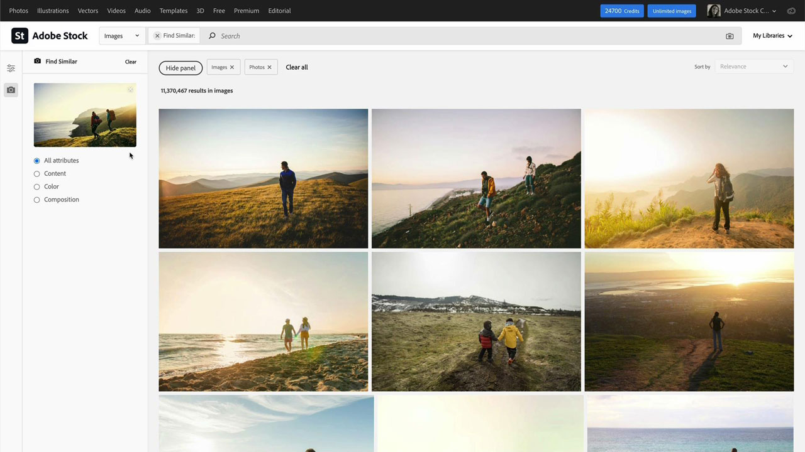
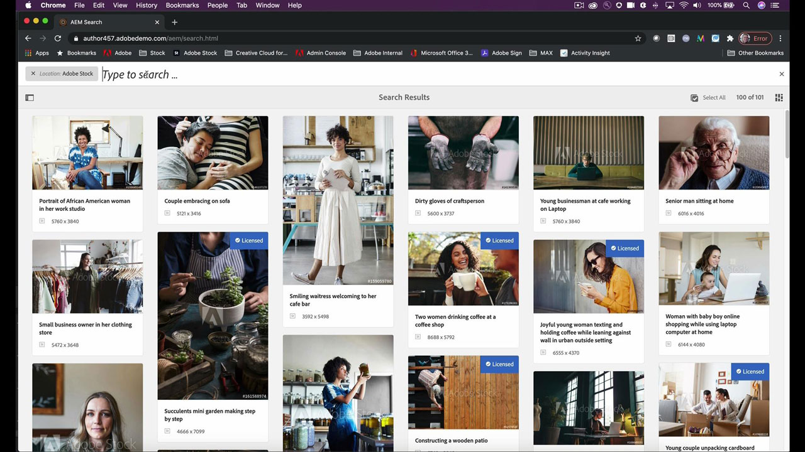

# [!DNL Stock]

Kreatörer pressas att snabbt leverera nytt, visuellt övertygande innehåll som fångar och håller uppmärksamheten. Adobe [!DNL Stock] for enterprise ger team tillgång till över 200 miljoner bilder, videoklipp, mallar, illustrationer, ljudfiler och 3D-resurser - allt inifrån de program i Adobe som de använder dagligen.

## Bläddra i Tutorials

<table style="table-layout:fixed">
<tr>
 <td>
   
    

   <a href="stock.md#tutorial1"><strong>Hitta de bästa resurserna snabbare med Adobe [!DNL Stock]</strong></a>
    

    <em>Hitta den royaltyfria arkivbilden som förbättrar dina projekt med bättre och snabbare sökresultat från Adobe Sensei, vår artificiella intelligensmotor</em>
     
  </td>
  <td>
   
    

   <a href="stock.md#tutorial2"><strong>Sök och licensiera [!DNL Stock] Resurser i Adobe Experience Manager</strong></a>
    

    <em>Förenkla uppladdningen av ditt licensierade Adobe [!DNL Stock] resurser i ditt digitala resurshanteringssystem</em>
     
  </td>
  <td>
    
    

     
  </td>
</tr>
</table>

## Hitta de bästa resurserna snabbare med Adobe [!DNL Stock] (10:49) {#tutorial1}

>[!VIDEO](https://video.tv.adobe.com/v/326951?hidetitle=true)

**Beskrivning**
Hitta den royaltyfria arkivbilden som förbättrar dina projekt med bättre och snabbare sökresultat från Adobe Sensei, vår artificiella intelligensmotor.

I den här självstudiekursen får du lära dig hur du:
* Slipp tidsödande och stressiga sökningar efter högkvalitativa bilder och videor
* Hantera och spåra licenser och användning i hela företaget
* Sök, förhandsgranska och licensiera direkt i Adobe Creative Cloud-programmen

**Presenteras av:**

Victoria Torres [!DNL Stock] Lösningskonsult (Digital Media)

## Sök och licensiera [!DNL Stock] Resurser i AEM (6:46) {#tutorial2}

>[!VIDEO](https://video.tv.adobe.com/v/326952?hidetitle=true)

**Beskrivning**
Förenkla uppladdningen av ditt licensierade Adobe [!DNL Stock] resurser i ditt digitala resurshanteringssystem.

I den här självstudiekursen får du lära dig hur du:
* Utför Adobe [!DNL Stock] resurssökning utan att lämna arbetsytan i AEM
* Spara licensierade mediefiler direkt i en AEM-mapp vid licensieringstillfället
* Visa mediefiler som licensierats från AEM i [!DNL Stock] licenshistorik på [!DNL Stock] webbplats.

**Presenteras av:**
Emily Palmer, lösningskonsult (Digital Media)

![[!DNL Stock] Logotyp](../assets/st_appicon_96.png)

**Adobe [!DNL Stock] Resurser**

[Utbildning och support](https://helpx.adobe.com/support/stock.html) är navet för ytterligare självstudiekurser och länkar till användarforum.

**Oktober 2020-utgåvan**

Börja använda dessa funktioner (och mycket mer!) genom att hämta den senaste uppdateringen från Creative Cloud-datorprogrammet.
