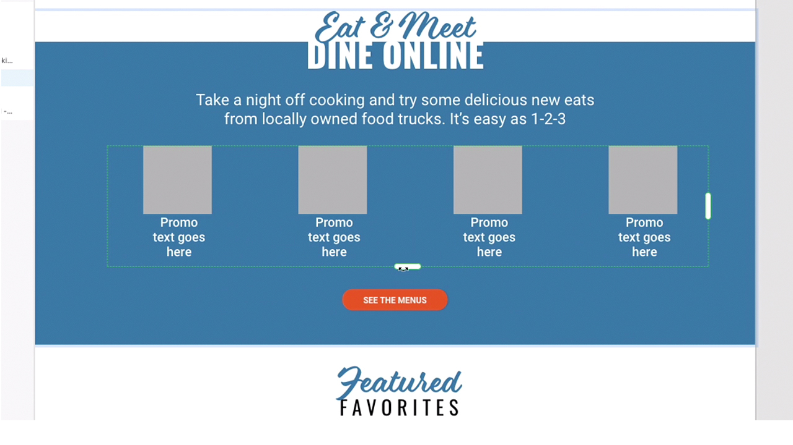
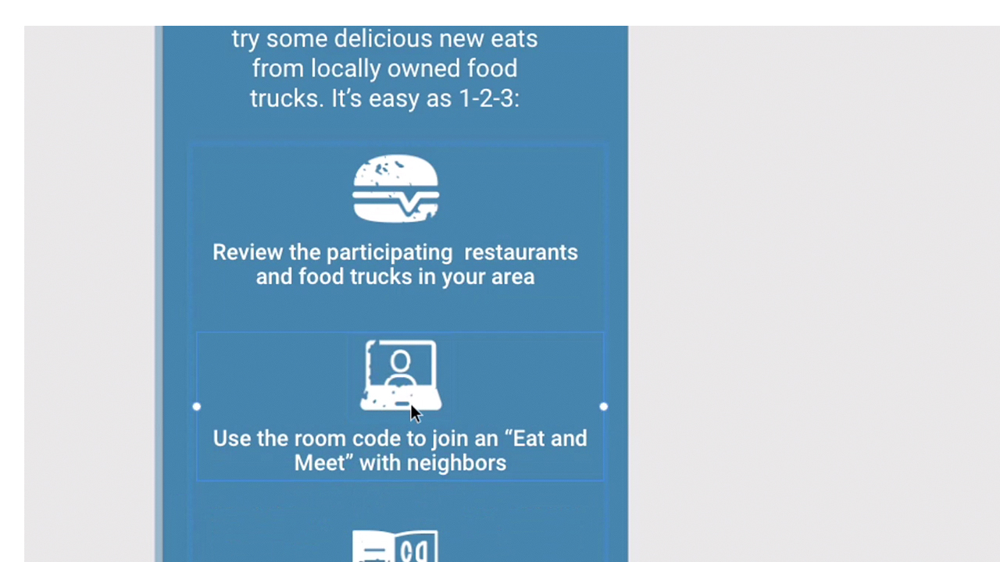
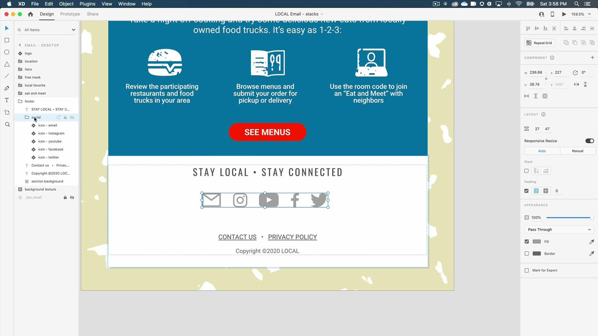

# XD

Adobe XD är ett verktyg för att utforma och skapa prototyper av webbplatser, appar, röstgränssnitt, spel och andra typer av digitala upplevelser.

## Bläddra i Tutorials Produkt

<table style="table-layout:fixed">
<tr>
 <td>
   
    

   <a href="xd.md#tutorial1"><strong>Skapa komponenter med hovringslägen</strong></a>
    

    <em>Skapa återanvändbara, dynamiskt skalbara knappar för dina interaktiva designer</em>
     
  </td>
  <td>
    
    

    <a href="xd.md#tutorial2"><strong>Skapa och fylla i ett upprepningsrutnät</strong></a>
    

    <em>Förvandla ett enskilt element till upprepade stödraster med ett enkelt klick och dra</em>
     
  </td>
  <td>
   
    

    <a href="xd.md#tutorial3"><strong>Arbeta med högar</strong></a>
    

    <em>Använd egenskapen stack för att enkelt ordna om element</em>
     
  </td>
</tr>
<tr>
 <td>
    
    

    <a href="xd.md#tutorial4"><strong>Skapa en prototyp - ankarlänkar och rullningsgrupper</strong></a>
    

    <em>Lägga till navigering och rullning i en prototyp</em>
     
  </td>
  <td>
    
    

    <a href="xd.md#tutorial5"><strong>Skapa en prototyp - Interaktiva komponentlägen</strong></a>
    

    <em>Lägga till interaktivitet och en överläggsmeny i en prototyp</em>
     
  </td>
  <td>
   
    

   <a href="xd.md#tutorial7"><strong>E-post - Skapa och fylla i ett upprepningsrutnät</strong></a>
    

    <em>Förvandla ett enskilt element till upprepade stödraster med ett enkelt klick och dra</em>
     
  </td>
</tr>
<tr>
 <td>
    
    

    <a href="xd.md#tutorial7"><strong>E-post - Arbeta med högar</strong></a>
    

    <em>Använd egenskapen stack för att enkelt ordna om element</em>
     
  </td>
  <td>
    
    

     
  </td>
  <td>
    
    

     
  </td>
</tr>
</table>

## Skapa [!UICONTROL komponenter] med hovringslägen (7:35) {#tutorial1}

>[!VIDEO](https://video.tv.adobe.com/v/326874?hidetitle=true)

****
BeskrivningSkapa återanvändbara, dynamiskt skalbara knappar för dina interaktiva designer.

I den här självstudiekursen får du lära dig att:
* Gör ändringar i en huvudkällkomponent så skickas ändringarna automatiskt till alla instanser av den komponenten
* Använd komponenter för enhetlighet, tidsbesparande, färre klick

**Presenteras av:**
Michael Murphy, Senior Solutions Consultant (Digital Media)

## Skapa och fylla i ett upprepningsstödraster (2:57) {#tutorial2}

>[!VIDEO](https://video.tv.adobe.com/v/326955?hidetitle=true)

****
BeskrivningFörvandla ett enskilt element till upprepade stödraster med ett enkelt klick och dra.

I den här självstudiekursen får du lära dig att:
* Förbättra arbetsflödet och dra ut det rutnät du behöver - direkt
* Infoga innehåll och data och XD monterar magiskt alla bilder och all text i stödrastret
* Gör ändringarna en gång och använd dem där du vill, i valfri riktning

**Presenteras av:**
Ashley Dvorin, Senior Solutions Consultant (Digital Media)

## Arbeta med högar (5:33) {#tutorial3}

>[!VIDEO](https://video.tv.adobe.com/v/326956?hidetitle=true)

****
BeskrivningAnvänd egenskapen stack för att enkelt ordna om element.

I den här självstudiekursen får du lära dig att:
* Bevara justering och mellanrum mellan objekt på arbetsytan även när designen ändras
* Infoga nya objekt eller ändra ordning på objekt i en stapel så justeras allt automatiskt

**Presenteras av:**
Michael Murphy, Senior Solutions Consultant (Digital Media)

## Skapa en prototyp - ankarlänkar och rullningsgrupper (9:55) {#tutorial4}

>[!VIDEO](https://video.tv.adobe.com/v/326957?hidetitle=true)

****
BeskrivningLägga till navigering och rullning i en prototyp.

I den här självstudiekursen får du lära dig att:
* Lägga till länkar till prototyper med en åtgärd som låter användarna hoppa till olika punkter på samma rityta
* Skapa aktivitetsflöden, bildspel, produktlistor med mera genom att definiera områden som rullar oberoende av resten av din design
* Skapa grupper som rullar lodrätt, vågrätt eller båda

**Presenteras av:**
Michael Murphy, Senior Solutions Consultant (Digital Media)

## Skapa en prototyp - Interaktiva komponentlägen (8:55) {#tutorial5}

>[!VIDEO](https://video.tv.adobe.com/v/326958?hidetitle=true)

****
BeskrivningLägg till interaktivitet och en överläggsmeny i en prototyp.

I den här självstudiekursen får du lära dig att:
* Skapa en icke-linjär interaktiv och animerad användarupplevelse utan att behöva fler ritytor
* Skapa flera prototyper eller interaktionsflöden i ett enda XD och publicera unika delningsbara länkar för varje flöde

**Presenterad av:**
Emilie Enke, Associate Solutions Consultant (Digital Media)

## E-post - Skapa och fylla i ett upprepningsrutnät (4:45) {#tutorial6}

>[!VIDEO](https://video.tv.adobe.com/v/326775?hidetitle=true)

****
BeskrivningFörvandla ett enskilt element till upprepade stödraster med ett enkelt klick och dra.

I den här självstudiekursen får du lära dig att:
* Förbättra arbetsflödet och dra ut det rutnät du behöver - direkt
* Infoga innehåll och data och XD monterar magiskt alla bilder och all text i stödrastret
* Gör ändringarna en gång och använd dem där du vill, i valfri riktning

**Presenteras av:**
Victoria Torres, Solutions Consultant (Digital Media)

## E-post - Arbeta med högar (3:38) {#tutorial7}

>[!VIDEO](https://video.tv.adobe.com/v/326759?hidetitle=true)

****
BeskrivningAnvänd egenskapen stack för att enkelt ordna om element.

I den här självstudiekursen får du lära dig att:
* Bevara justering och mellanrum mellan objekt på arbetsytan även när designen ändras
* Infoga nya objekt eller ändra ordning på objekt i en stapel så justeras allt automatiskt

**Presenteras av:**
Victoria Torres, Solutions Consultant (Digital Media)

**XD**

[Lär dig mer och ](https://helpx.adobe.com/support/xd.html) Support om du vill ha fler självstudiekurser,  [nyheter](https://helpx.adobe.com/xd/user-guide.html/xd/help/whats-new.ug.html) och länkar till användarforum.

**Oktober 2020-versionen**

Börja använda dessa funktioner (och mycket mer!) genom att hämta den senaste uppdateringen från Creative Cloud-datorprogrammet.
