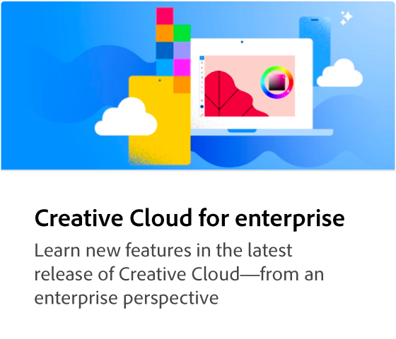
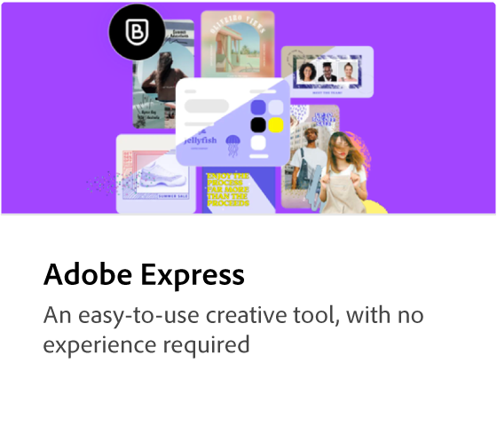
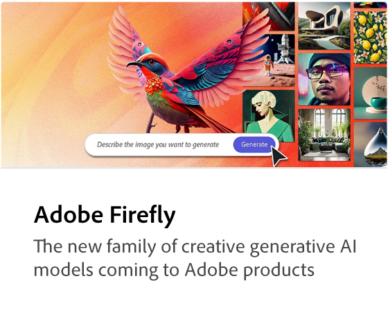
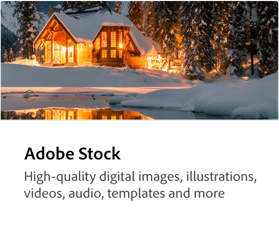
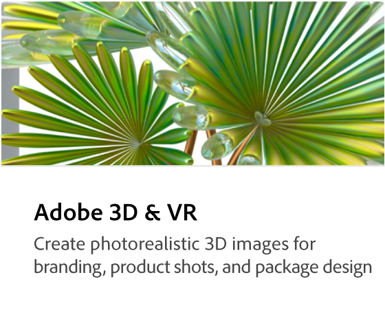
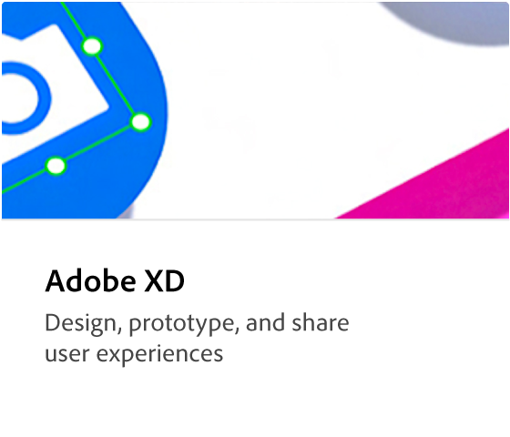
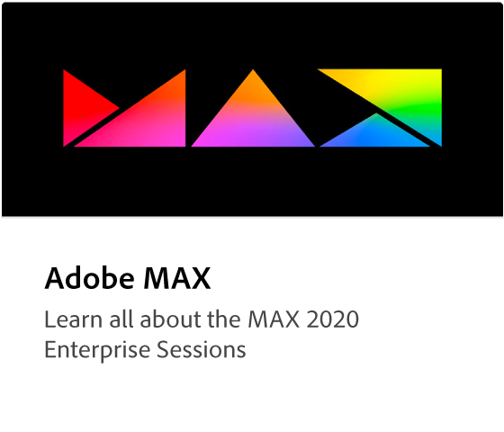

# Självstudiekurser om Creative Cloud for enterprise

Välkommen till utbildningsnavet Creative Cloud för företag. Här hittar du ett brett utbud av utbildningar med fokus på Creative Cloud för företag. Våra självstudiekurser, webbseminarier och användningsfall är utformade för att snabbt hålla både nybörjare och administratörer uppdaterade om Creative Cloud för företagsprodukter.

## Bläddra bland ämnen

<table style="table-layout:fixed">
<tr>
  <td>
    
  </td>
  <td>
    
  </td>
  <td>
    
  </td>
  <td>
    
  </td>
</tr>
  <td>
   
  </td>
  <td>
  
  </td>
  <td>
    
  </td>
  <td>
    
  </td>
</tr>
</table>
