# Adobe [!DNL Stock] självstudiekurser

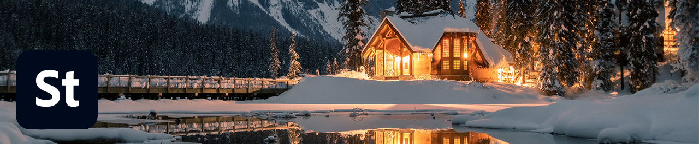

Kreatörer pressas att snabbt leverera engagerande visuellt innehåll. Adobe Stock ger team tillgång till över 300 miljoner royaltyfria bilder, videoklipp, ljudfiler, mallar, illustrationer och 3D-mediefiler - inifrån de Creative Cloud-program de använder dagligen. Få obegränsad tillgång till Adobe Stock standardmediefiler med Creative Cloud Pro Edition. Utforska de senaste samlingarna på stock.adobe.com. Välj en bild för att visa en självstudiekurs.

<table>
<tr>
   <td>
      
      

      <a href="stunning-digital-assets.md"><strong>Fantastiska digitala resurser</strong></a>
      

      <em>Lär dig integrera Adobe Stock med CC Libraries för att skapa enhetliga och professionella designresultat för tryck och skärm i den här praktiska självstudiekursen</em>
       
  </td>
  <td>
      <a href="searchstock.md">
         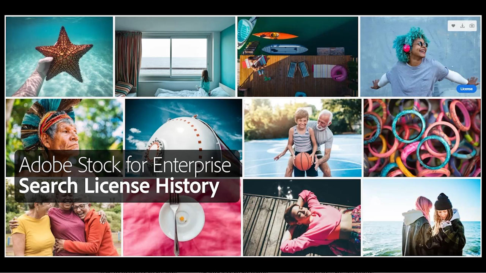
      </a>
      

      <a href="searchstock.md"><strong>Sök i Adobe [!DNL Stock] licenshistorik</strong></a>
      

      <em>Läs om hur du snabbt söker i organisationens Adobe [!DNL Stock] licenshistorik i Creative Cloud för företag</em>
       
  </td>
  <td>
      <a href="handdrawn.md">
         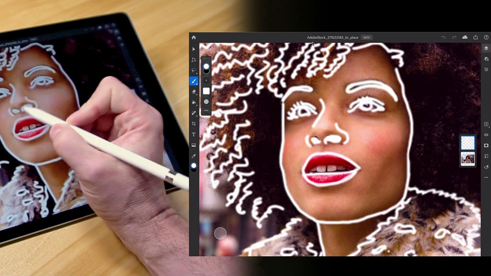
      </a>
      

      <a href="handdrawn.md"><strong>Lägg till en handritad estetik i Adobe [!DNL Stock] bilder</strong></a>
      

      <em>Förstärk marknadsföringen med unika tekniker som ger djup och dimension åt bilderna med Photoshop för iPad</em>
       
  </td>
  <td>
   
    

   <a href="flairtypography.md"><strong>Ge typografin en personlig prägel med masker och animeringar</strong></a>
    

    <em>Ge liv åt ditt material med element från Adobe [!DNL Stock] och animeringsformat från After Effects</em>
     
  </td>
</tr>
<tr>
  <td>
      <a href="animatevector.md">
         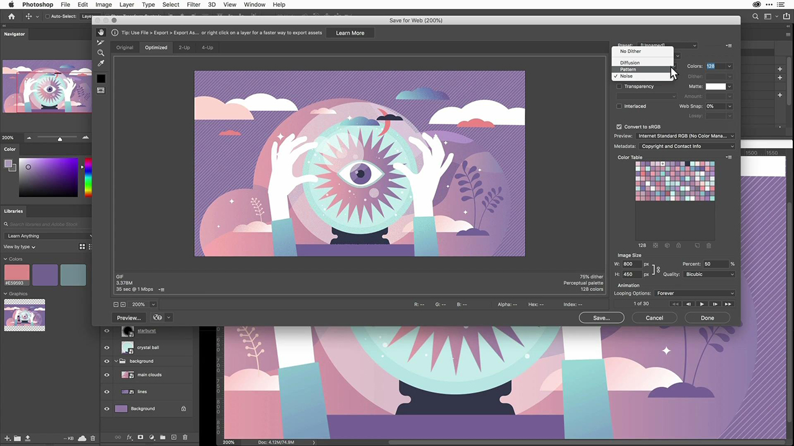
      </a>
      

      <a href="animatevector.md"><strong>Animera en Adobe [!DNL Stock] vektorillustration i Photoshop</strong></a>
      

      <em>Få animering i nyhetsbrevets grafik med redigerbara vektorer för Adobe [!DNL Stock]</em>
       
  </td>
 <td>
      <a href="annualreport.md">
         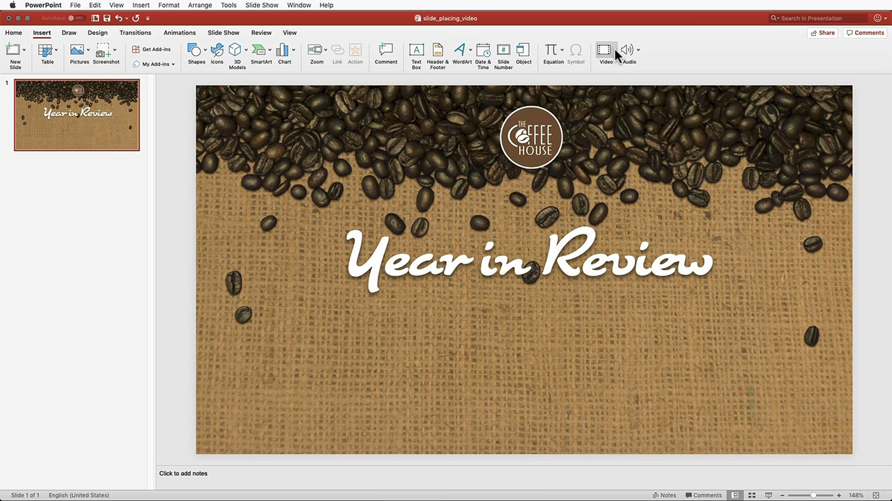
      </a>
      

      <a href="annualreport.md"><strong>Börja din årsrapport med en videofilm som skapats med Adobe [!DNL Stock] och Spark Video</strong></a>
      

      <em>Gör din årsredovisning till en berättelse med Adobe [!DNL Stock] och Spark Video</em>
       
  </td>
  <td>
      <a href="customanimations.md">
         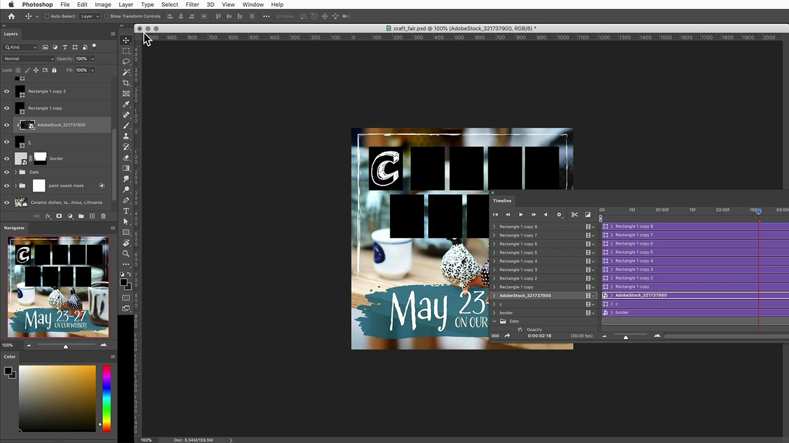
      </a>
      

      <a href="customanimations.md"><strong>Ge liv åt kreativiteten med anpassade animeringar från Adobe [!DNL Stock]</strong></a>
      

      <em>Använd Adobe [!DNL Stock] bilder, texturer, mönster till anpassade animeringar i Photoshop</em>
       
  </td>
  <td>
      <a href="changecolors.md">
         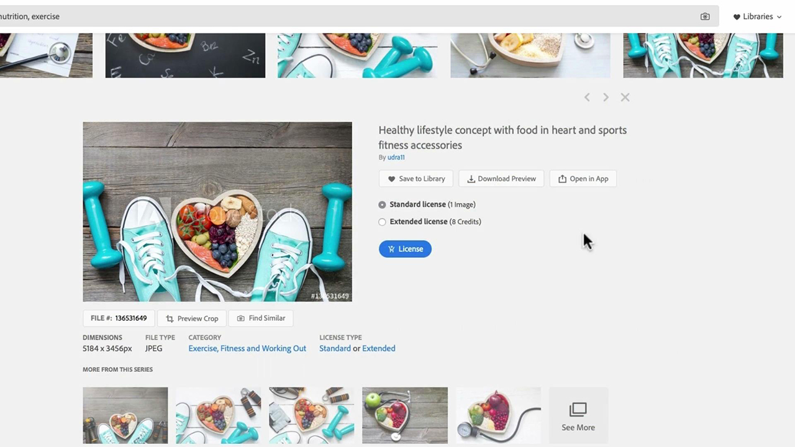
      </a>
      

      <a href="changecolors.md"><strong>Ändra en Adobe [!DNL Stock] bildens färger så att de matchar din berättelse</strong></a>
      

      <em>Hitta ett unikt foto i Adobe [!DNL Stock] och justera sedan färgerna i Adobe Photoshop efter dina behov</em>
       
  </td>
</tr>
<tr>
 <td>
      <a href="collage.md">
         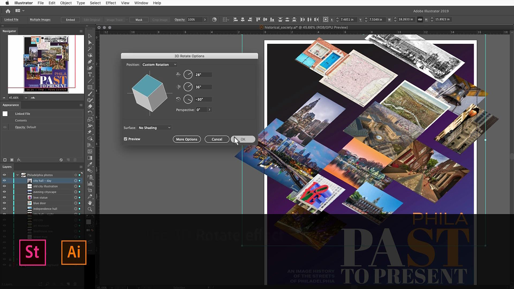
      </a>
      

      <a href="collage.md"><strong>Skapa ett 3D-collage för en affisch med Adobe [!DNL Stock] bilder</strong></a>
      

      <em>Designa ett collage i Adobe Illustrator med en iögonfallande 3D-effekt från bilder i Adobe [!DNL Stock]</em>
       
  </td>
  <td>
      <a href="boldlabel.md">
         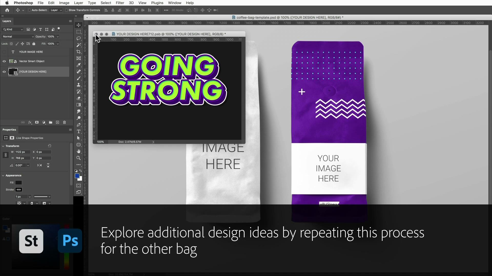
      </a>
      

      <a href="boldlabel.md"><strong>Skapa en fet etikett med Adobe [!DNL Stock] och smarta objekt i Photoshop</strong></a>
      

      <em>Designa och visualisera dina egna designer med realistiska förpackningsmallar från Adobe [!DNL Stock]</em>
       
  </td>
  <td>
      <a href="infographic.md">
         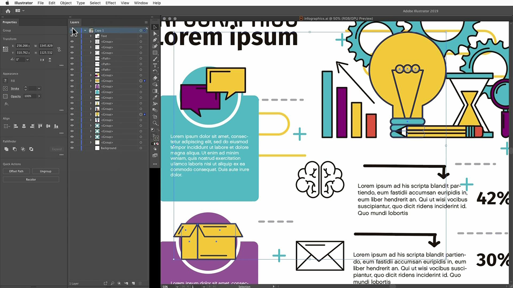
      </a>
      

      <a href="infographic.md"><strong>Skapa en infografik med riktlinjer för företag med Adobe [!DNL Stock]</strong></a>
      

      <em>Kombinera olika resurser från Adobe [!DNL Stock] att förmedla riktlinjer i form av visuellt slagkraftig infografik</em>
       
  </td>
 <td>
      <a href="featurecomparison.md">
         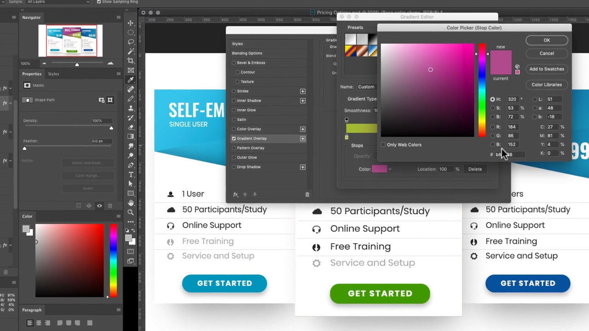
      </a>
      

      <a href="featurecomparison.md"><strong>Skapa en produktjämförelse med Adobe [!DNL Stock]</strong></a>
      

      <em>Skapa en bild som jämför produktprisplaner för att ge potentiella kunder den information de behöver i korthet</em>
       
  </td>
</tr>
<tr>
   <td>
      <a href="surrealcomposite.md">
         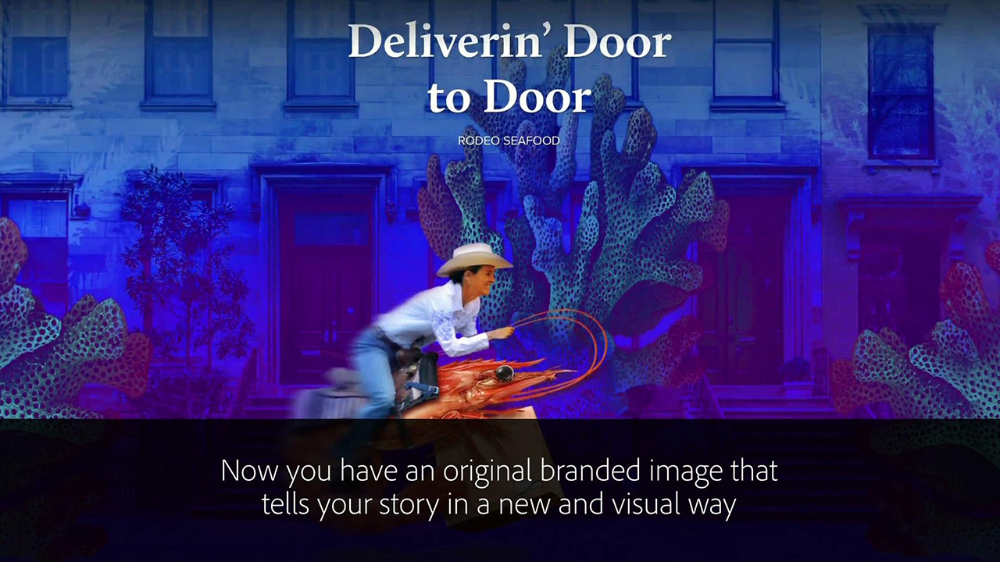
      </a>
      

      <a href="surrealcomposite.md"><strong>Skapa ett halvsurrealistiskt montage med Adobe [!DNL Stock]</strong></a>
      

      <em>Skapa en minnesvärd redaktionell bild genom att kombinera flera bilder med färg, rörelse och maskeringseffekter</em>
       
  </td>
   <td>
      <a href="surrealpattern.md">
         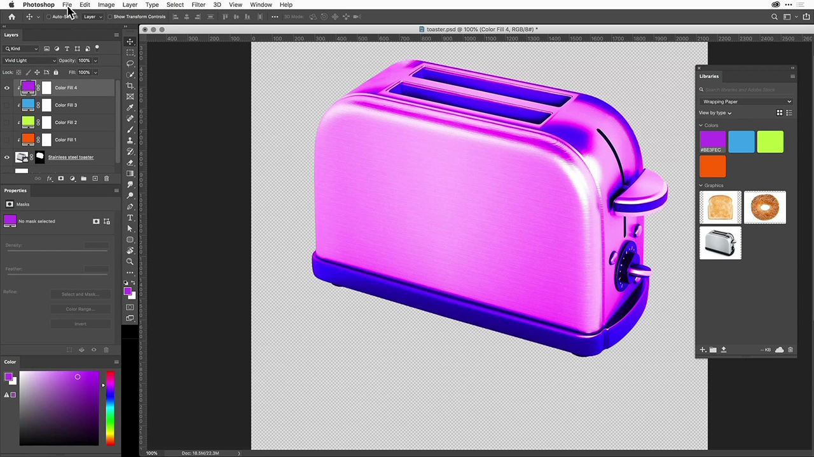
      </a>
      

      <a href="surrealpattern.md"><strong>Skapa ett halvsurrealistiskt mönster med Adobe [!DNL Stock]</strong></a>
      

      <em>Skapa ett vackert sömlöst mönster baserat på surrealistiska bilder från Adobe [!DNL Stock]</em>
       
  </td>
   <td>
      <a href="productconfigurator.md">
         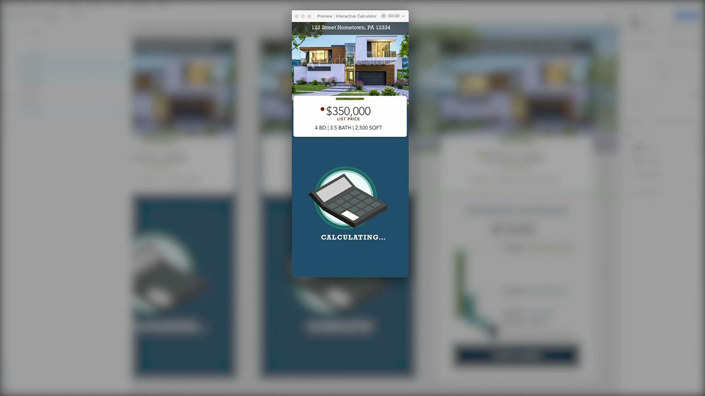
      </a>
      

      <a href="productconfigurator.md"><strong>Skapa en interaktiv produktkonfigurator med Adobe [!DNL Stock]</strong></a>
      

      <em>Använd kraften i interaktivitet, animering och redigerbar grafik från Adobe [!DNL Stock] att presentera finansiell information på ett visuellt sätt</em>
       
  </td>
  <td>
      <a href="interactivetourismphoto.md">
         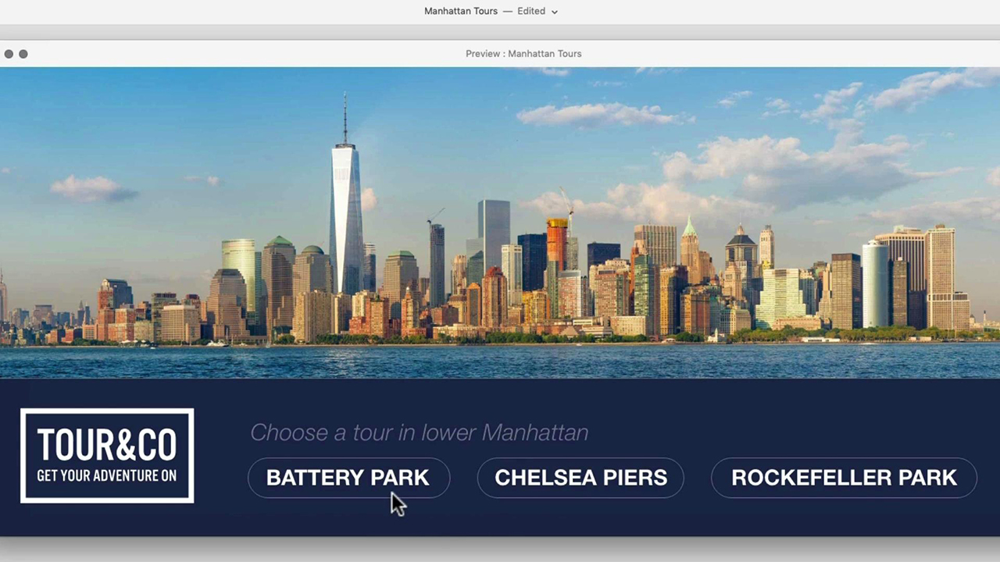
      </a>
      

      <a href="interactivetourismphoto.md"><strong>Skapa ett interaktivt turistfoto med Adobe [!DNL Stock] och XD</strong></a>
      

      <em>Skapa snabbt ett interaktivt foto i webbplatsprototypen med Adobe [!DNL Stock] &amp; XD</em>
       
  </td>
</tr>
<tr>
 <td>
      <a href="animationemail.md">
         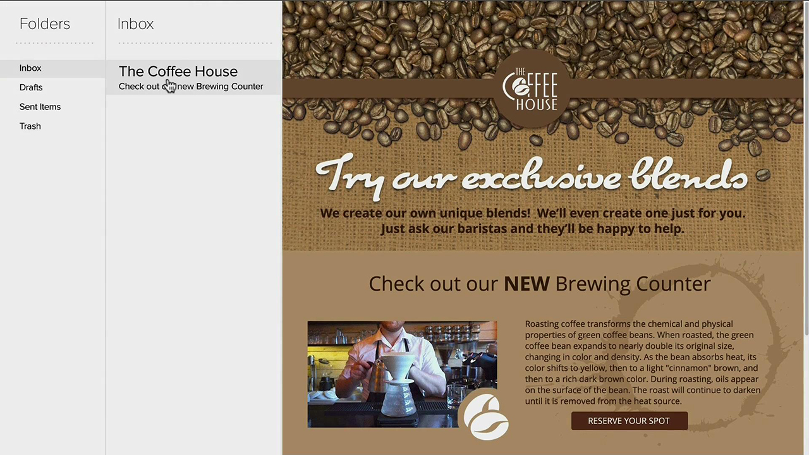
      </a>
      

      <a href="animationemail.md"><strong>Skapa animeringar för e-post med Adobe [!DNL Stock] och Photoshop</strong></a>
      

      <em>Förbättra dina e-postmeddelanden med actionanimering med Adobe [!DNL Stock] och Photoshop</em>
       
  </td>
  <td>
      <a href="brandgradients.md">
         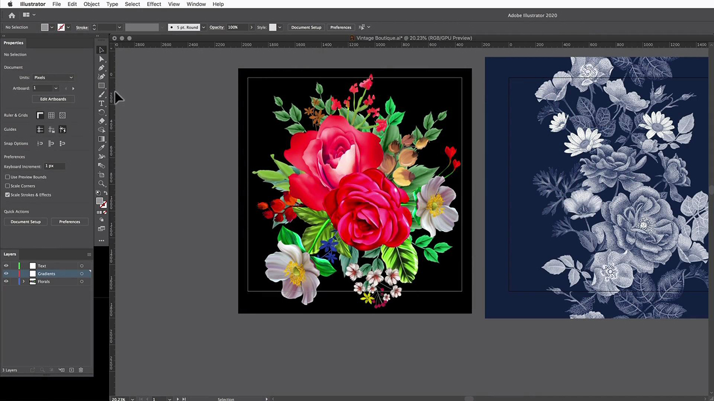
      </a>
      

      <a href="brandgradients.md"><strong>Skapa sammanhängande varumärkesbilder med vackra övertoningar och Adobe [!DNL Stock] resurser</strong></a>
      

      <em>Skapa varumärkesidentitet med olika bilder genom att kombinera färger och övertoningar i hela annonskampanjen</em>
       
   </td>
  <td>
      <a href="webgraphics.md">
         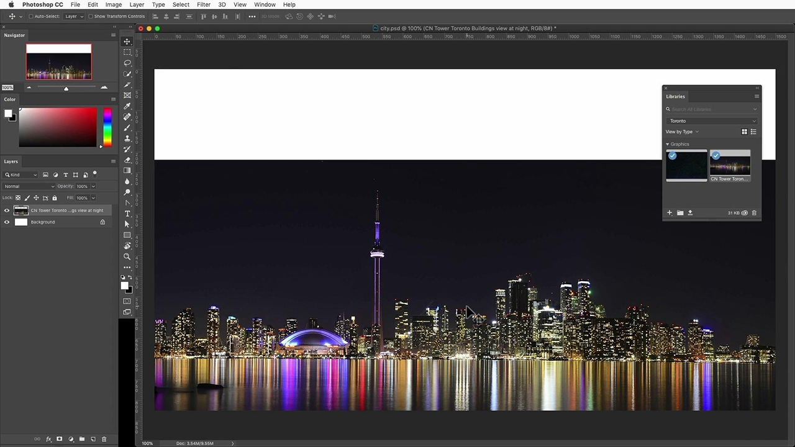
      </a>
      

      <a href="webgraphics.md"><strong>Skapa engagerande webbgrafik genom att kombinera Adobe [!DNL Stock] bilder med CSS</strong></a>
      

      <em>Skapa varumärkesidentitet med olika bilder genom att kombinera färger och övertoningar i hela annonskampanjen</em>
       
  </td>
  <td>
      <a href="moodboard.md">
         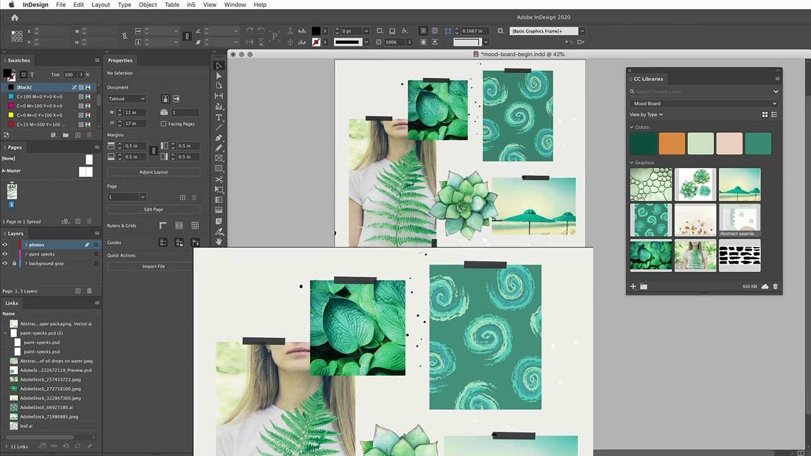
      </a>
      

      <a href="moodboard.md"><strong>Skapa inspirerande humörtavlor på nolltid med Adobe [!DNL Stock]</strong></a>
      

      <em>Skapa en stämningstavla för projekt för att vidarebefordra information, idéer, bilder och färgpaletter till team/kunder</em>
       
  </td>
</tr>
<tr>
   <td>
      <a href="realisticcomposite.md">
         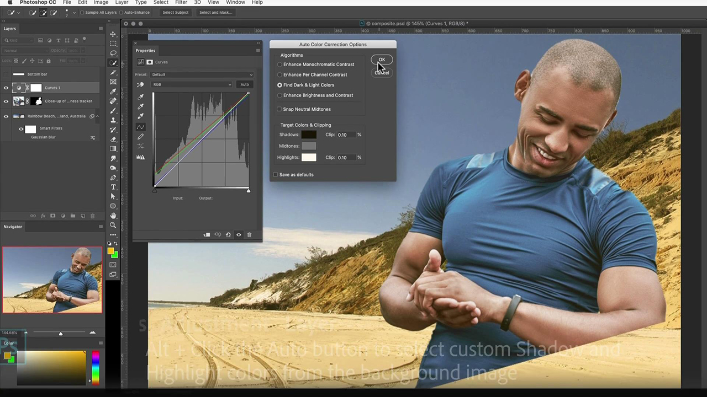
      </a>
      

      <a href="realisticcomposite.md"><strong>Skapa realistiska fotomontage med Adobe [!DNL Stock] bilder</strong></a>
      

      <em>Samla två stora Adobe [!DNL Stock] foton för att dra in personer i dina sociala inlägg</em>
       
  </td>
   <td>
   <a href="loadingscreen.md">
      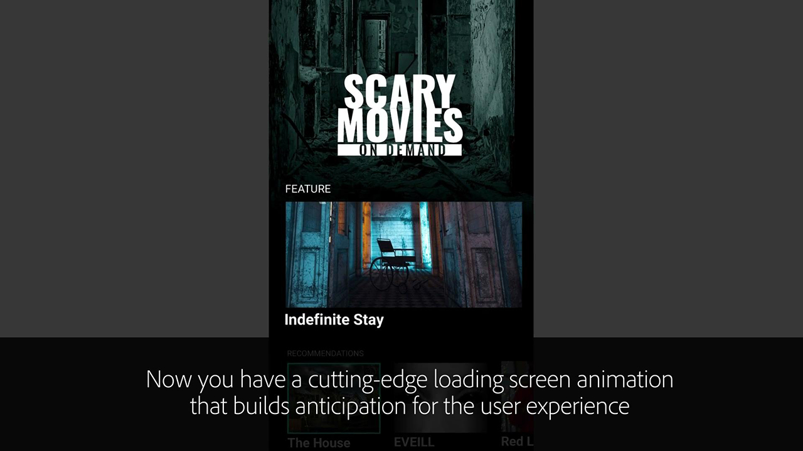
   </a>
    

   <a href="loadingscreen.md"><strong>Anpassa en inläsningsskärmanimering med Adobe [!DNL Stock] och XD</strong></a>
    

    <em>Anpassa vektorgrafik från Adobe [!DNL Stock] för att skapa en kylig skärmanimering för en mobilapp</em>
     
  </td>
  <td>
   <a href="presentationtemplate.md">
      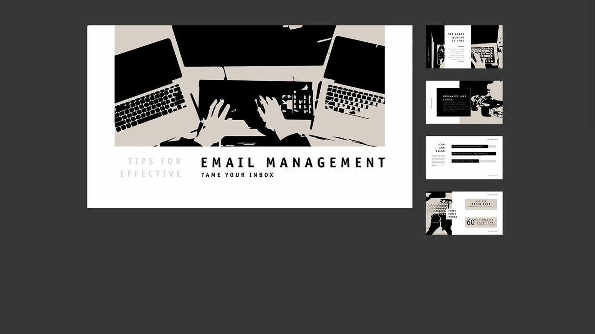
   </a>
    

   <a href="presentationtemplate.md"><strong>Anpassa en Adobe [!DNL Stock] presentationsmall som ser proffsig men ändå tilltalande ut</strong></a>
    

    <em>Skapa en elegant och stiliserad presentation på några minuter med bilder och mallar från Adobe [!DNL Stock] och några lättanvända specialeffekter</em>
     
  </td>
   <td>
   <a href="customizecolors.md">
      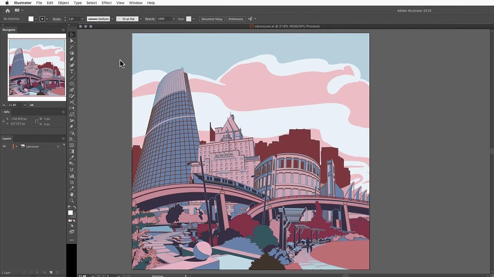
   </a>
    

   <a href="customizecolors.md"><strong>Anpassa färgerna i en Adobe [!DNL Stock] vektorillustration</strong></a>
    

    <em>Snygga till alla slags projekt med en snygg illustration. Hitta den perfekta vektorn i Adobe [!DNL Stock]och sedan matcha färgerna med projektpaletten med Adobe Illustrator</em>
     
  </td>
</tr>
<tr>
   <td>
      
      

      <a href="assets/AddMotiontoStillImageswithAdobeStockandPhotoshop.pdf"><strong>Lägg till rörelse i stillbilder med Adobe [!DNL Stock] och Photoshop (PDF)</strong></a>
      

      <em>Imponera på publiken på vilken skärm som helst genom att lägga in video i en stillbild</em>
       
   </td>
   <td>
   <a href="assets/CreateacompositewithPhotoshopontheiPadandAdobeStockimages.pdf" target="_blank">
      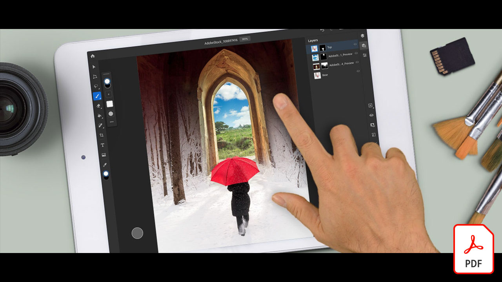
   </a>
    

   <a href="assets/CreateacompositewithPhotoshopontheiPadandAdobeStockimages.pdf" target="_blank"><strong>Skapa en sammansatt bild med Photoshop på iPad och Adobe [!DNL Stock] bilder (PDF)</strong></a>
    

    <em>Lär dig använda ett av dina favoritprogram från Adobe Creative Cloud på ett helt nytt sätt med kraften i Photoshop på din iPad</em>
     
  </td>
   <td>
   
    

   <a href="assets/CreateaUniqueEditorialGraphicwithAfterEffectsandAdobeStock.pdf" target="_blank"><strong>Animera en Adobe [!DNL Stock] vektorillustration i Photoshop (PDF)</strong></a>
    

    <em>Genom att kombinera After Effects med Adobe [!DNL Stock], kan du snabbt skapa fantastiska specialeffekter som hjälper dig att berätta en historia visuellt</em>
     
  </td>
   <td>
      <a href="assets/CreateUniqueGraphicsbyCombiningAdobeStockImages.pdf" target="_blank">
         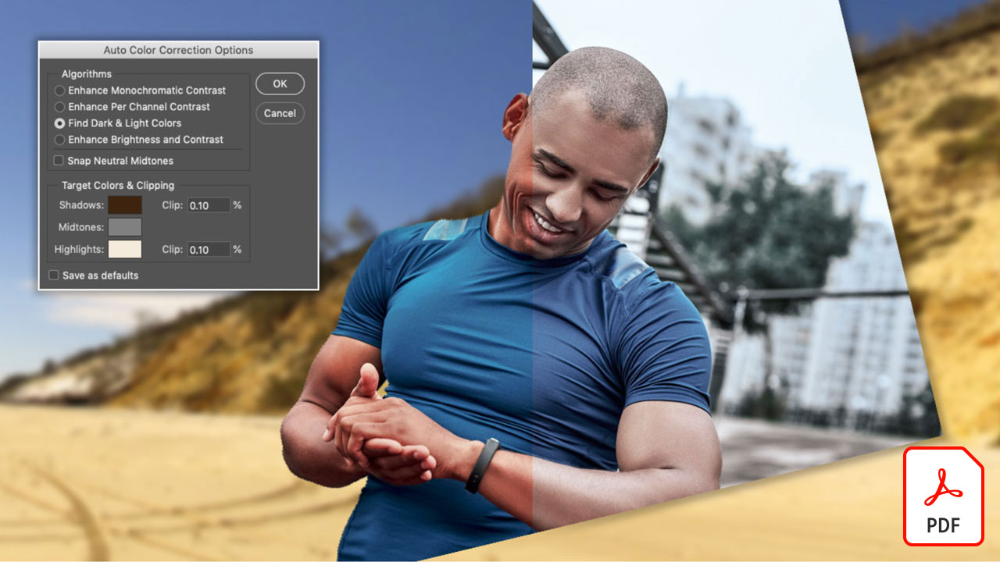
      </a>
      

      <a href="assets/CreateUniqueGraphicsbyCombiningAdobeStockImages.pdf" target="_blank"><strong>Skapa grafik genom att kombinera Adobe [!DNL Stock] bilder (PDF)</strong></a>
      

      <em>Sammanställ två olika bilder för att skapa en helt ny scen för dina designprojekt. Adobe [!DNL Stock] och Adobe Photoshop gör det enkelt</em>
       
   </td>
</tr>
<tr>
  <td>
      <a href="assets/CreatingaHalloweenCinemagraphwithPhotoshopCCandAdobeStock.pdf" target="_blank">
         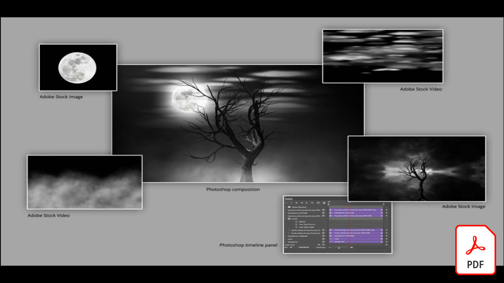
      </a>
      

      <a href="assets/CreatingaHalloweenCinemagraphwithPhotoshopCCandAdobeStock.pdf" target="_blank"><strong>Skapa en Halloween-film med Photoshop CC och Adobe [!DNL Stock] (PDF)</strong></a>
      

      <em>Skapa ett filmstycke genom att sätta ihop video, illustrationer och foton med Adobe Photoshop</em>
       
  </td>
   <td>
      <a href="assets/PutyourDatainMotionwithAdobeStockandPremierePro.pdf" target="_blank">
         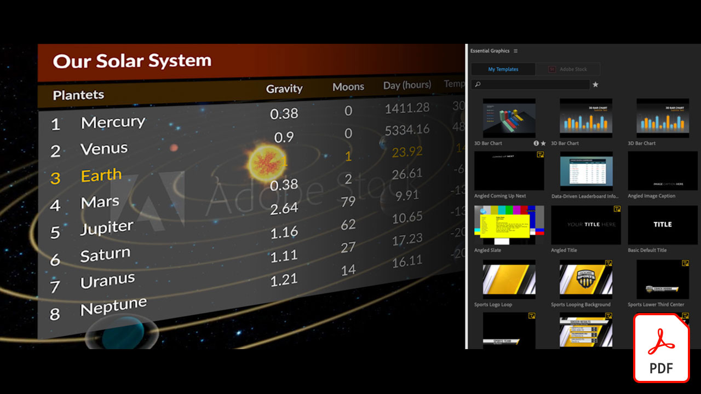
      </a>
      

      <a href="assets/PutyourDatainMotionwithAdobeStockandPremierePro.pdf" target="_blank"><strong>Sätt fart på dina data med Adobe [!DNL Stock] och Premiere Pro (PDF)</strong></a>
      

      <em>Ge liv åt dina data och berätta en mer övertygande historia med hjälp av Adobe [!DNL Stock] och Adobe Premiere Pro</em>
       
  </td>
   <td>
      <a href="assets/RecolorAdobeStockVectorArtworkwithAdobeIllustratortoGetExactlytheLookYouWant.pdf" target="_blank">
         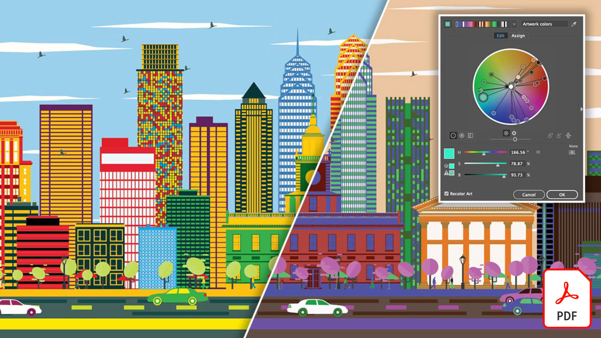
      </a>
      

      <a href="assets/RecolorAdobeStockVectorArtworkwithAdobeIllustratortoGetExactlytheLookYouWant.pdf" target="_blank"><strong>Färga om Adobe [!DNL Stock] vektorgrafik med Adobe Illustrator för att få exakt det utseende du vill ha (PDF)</strong></a>
      

      <em>Adobe [!DNL Stock] gör det enkelt att hitta unik vektorgrafik, och med Adobe Illustrator kan du snabbt ändra den så att den matchar din vision</em>
       
   </td>
   <td>
      <a href="assets/ShowOffyourDesignWorkintheRealWorldwithAdobeStockandPhotoshop.pdf" target="_blank">
         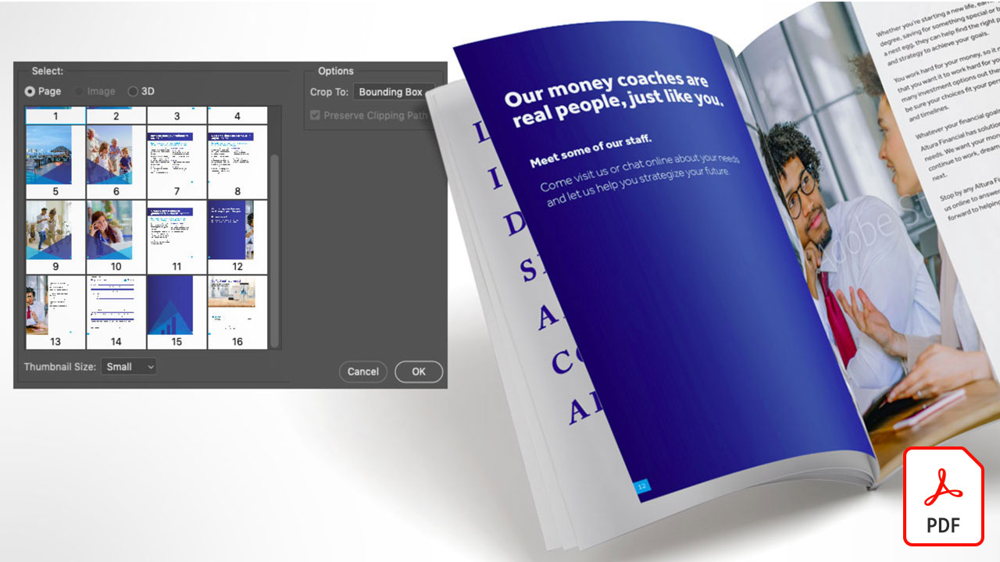
      </a>
      

      <a href="assets/ShowOffyourDesignWorkintheRealWorldwithAdobeStockandPhotoshop.pdf" target="_blank"><strong>Visa upp ditt designarbete i verkligheten med Adobe [!DNL Stock] och Photoshop (PDF)</strong></a>
      

      <em>Följ de här stegen för att visa upp ditt material i ett naturtroget Adobe [!DNL Stock] mall med Adobe Photoshop</em>
       
  </td>
 </tr> 
 <tr>
   <td>
      <a href="assets/UncoveramazingdetailsinAdobeStockimageswithLightroomformobile.pdf" target="_blank">
         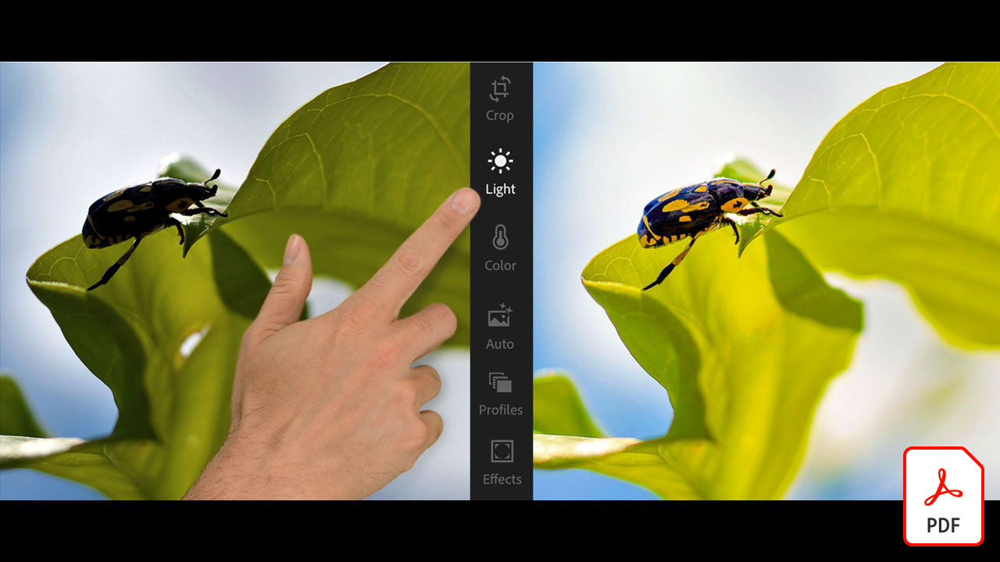
      </a>
      

      <a href="assets/UncoveramazingdetailsinAdobeStockimageswithLightroomformobile.pdf" target="_blank"><strong>Hitta otroliga detaljer i Adobe [!DNL Stock] bilder med Lightroom for mobile (PDF)</strong></a>
      

      <em>Upptäck kraften i Lightroom på din mobila enhet för att ta fram det bästa i dina bilder</em>
       
  </td>
  <td>
      <a href="assets/VisualizePosterDesignsintheRealWorldwithAdobeStockandPhotoshop.pdf" target="_blank">
         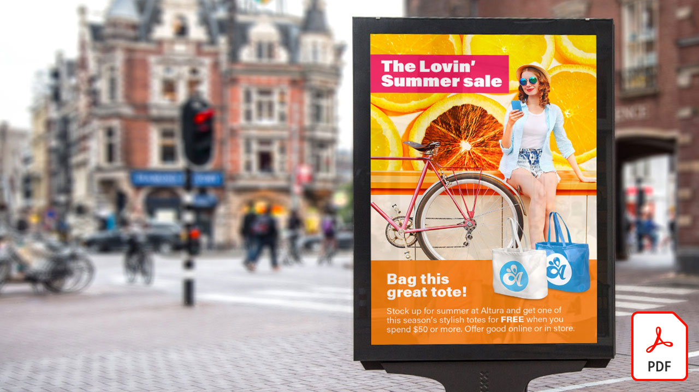
      </a>
      

      <a href="assets/VisualizePosterDesignsintheRealWorldwithAdobeStockandPhotoshop.pdf" target="_blank"><strong>Visualisera affischdesign i verkligheten med Adobe [!DNL Stock] och Photoshop (PDF)</strong></a>
      

      <em>Visa upp dina designer i verkliga miljöer för att få en bättre känsla för hur de ser ut i världen</em>
       
  </td>
  <td>
    
    

     
  </td>
</tr>
</table>
