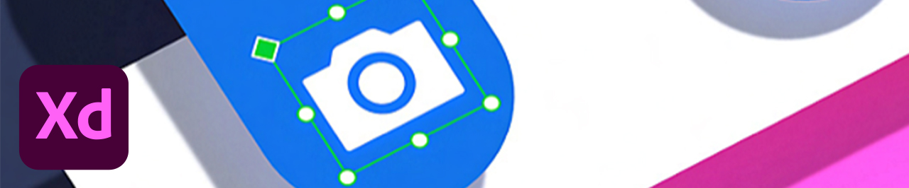
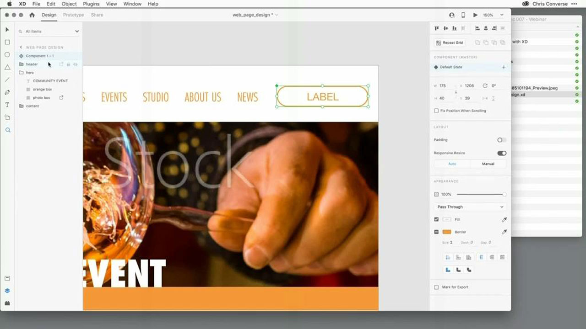
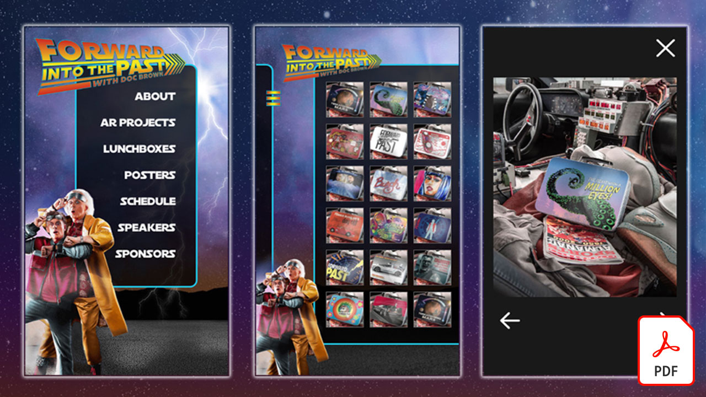
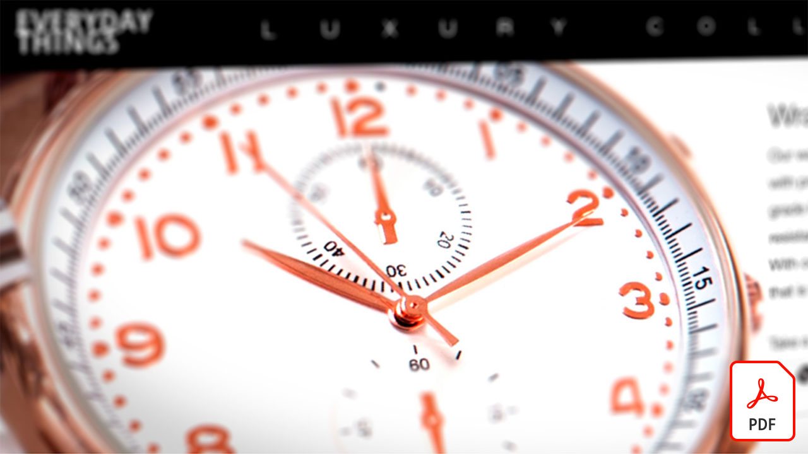
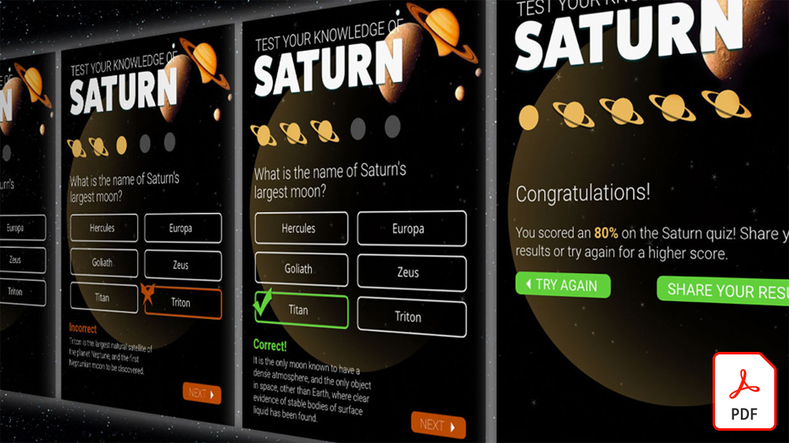
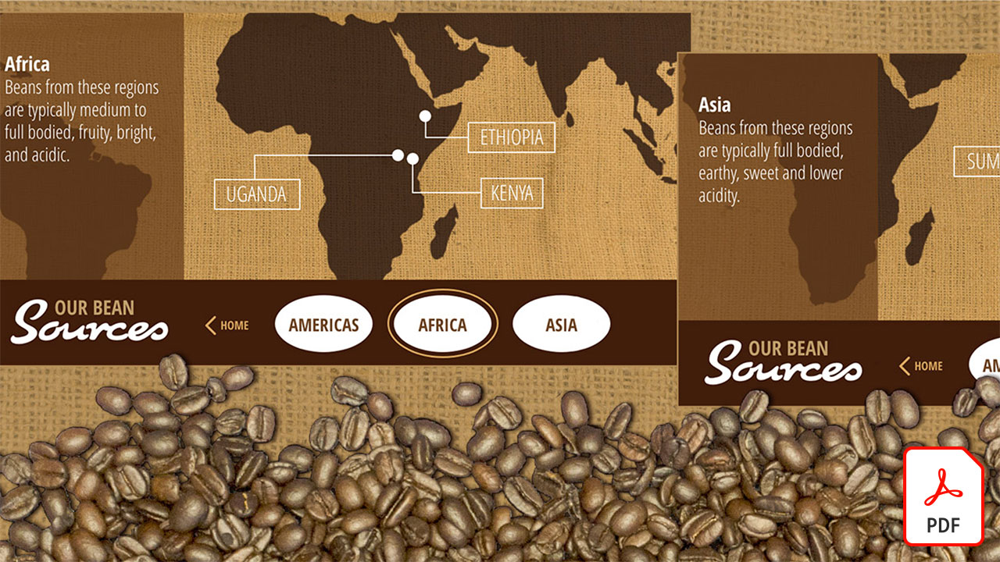
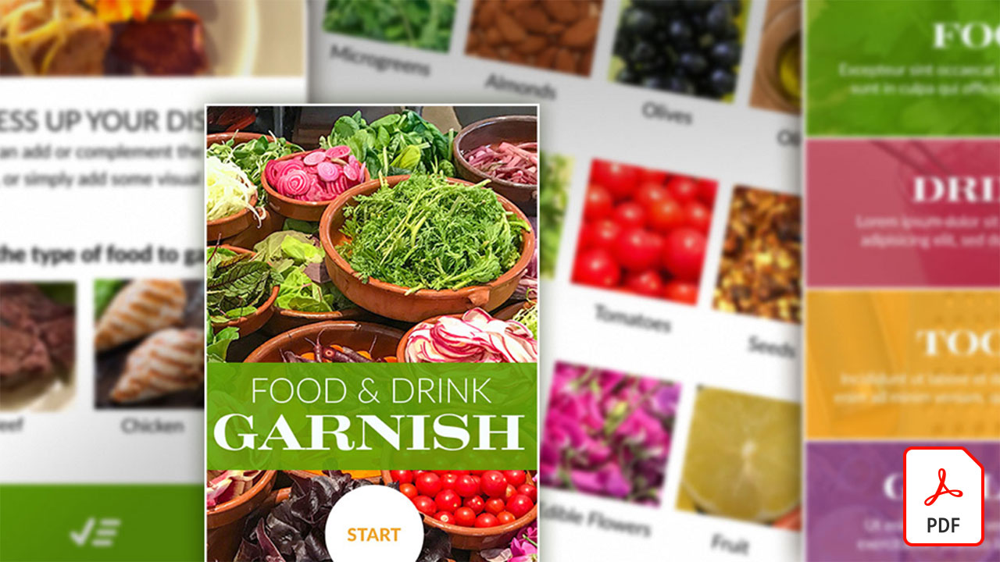
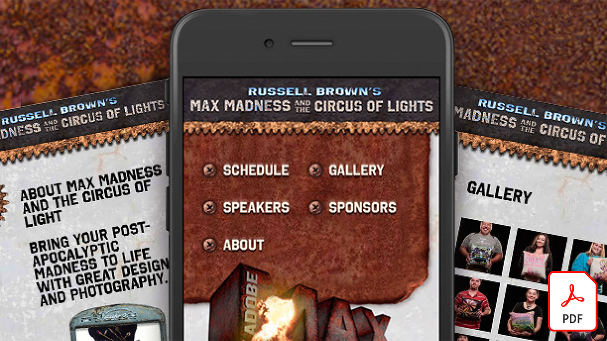
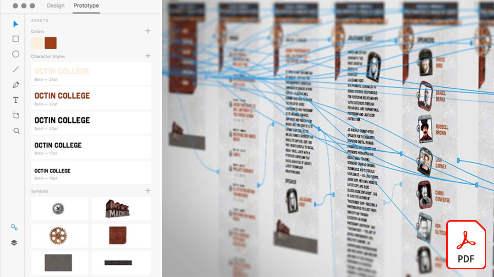
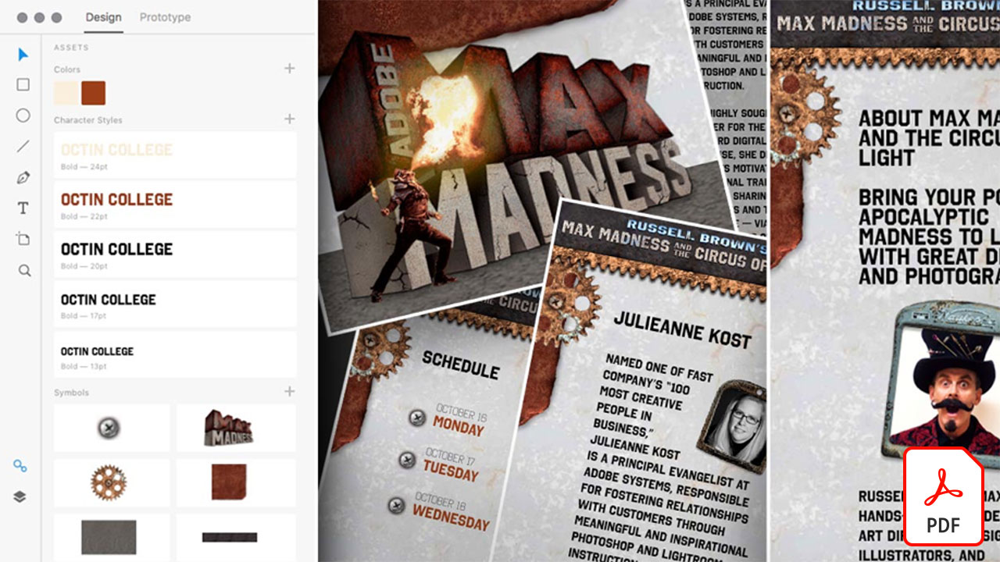

# Självstudiekurser för Adobe XD

Adobe XD är ett verktyg för design och prototyper av användarupplevelser för att designa webbplatser, appar, röstgränssnitt, spel och andra typer av digitala upplevelser.

## Klicka här om du vill se en Adobe XD-självstudiekurs

<table>
<tr>
 <td>
   
    

   <a href="components.md"><strong>Bekanta dig med [!UICONTROL Components] i Adobe XD</strong></a>
    

    <em>Lär dig hur du använder [!UICONTROL Components] för att få oöverträffad flexibilitet när du snabbt och enhetligt använder designarbetsflödet</em>
     
  </td>
  <td>
   
    

   <a href="assets/ControlMultipleXDArtboardswithNestedSymbols.pdf"><strong>Styra flera XD-ritytor med kapslade symboler (PDF)</strong></a>
    

    <em>Symboler är ett utmärkt sätt att skapa återanvändbara teckningar och text som kan användas flera gånger på ritytor i projektet</em>
     
  </td>
  <td>
   
    

   <a href="assets/CreateaZoomableeCommercePhotowithXDandAdobeStock.pdf"><strong>Skapa ett zoombart e-handelsfoto med XD och Adobe [!DNL Stock] (PDF)</strong></a>
    

    <em>Genom att kombinera högupplösta foton med funktionen Animera automatiskt i Adobe XD kan du skapa mer engagerande upplevelser för webbplatsen</em>
     
  </td>
</tr>
<tr>
 <td>
   
    

   <a href="assets/CreatingaRotatingProductInterfaceforECommercewithAdobeXD.pdf"><strong>Skapa ett roterande produktgränssnitt för e-handel med Adobe XD (PDF)</strong></a>
    

    <em>Designa ett gränssnitt som ger en roterande vy av produkten, och sedan kan du förvandla din design till en interaktiv prototyp som visar exakt hur upplevelsen kommer att fungera på webben eller mobilen</em>
     
  </td>
  <td>
   
    

   <a href="assets/DesignandPrototypeanInteractiveQuizwithXD.pdf"><strong>Designa och skapa prototyper för interaktiva frågor med XD (PDF)</strong></a>
    

    <em>Utforma den feedback en användare kommer att få under ett projekt</em>
     
  </td>
  <td>
   
    

   <a href="assets/DesignInteractiveProjectswithMicroAnimationsinXD.pdf"><strong>Designa interaktiva projekt med mikroanimeringar i XD (PDF)</strong></a>
    

    <em>Lär dig skapa interaktiva animerade prototyper av dina designer med Adobe XD</em>
     
  </td>
</tr>
<tr>
 <td>
   
    

   <a href="assets/JumpstartyourXDProjectfromaPhotoshopFile.pdf"><strong>Snabbstarta XD-projekt från en Photoshop-fil (PSD) (PDF)</strong></a>
    

    <em>Adobe XD har några fantastiska interaktiva designverktyg som fungerar tillsammans med ditt befintliga arbetsflöde, så att du kan utveckla din interaktiva designvision</em>
     
  </td>
  <td>
   
    

   <a href="assets/MobileWebExperienceswithXD.pdf"><strong>Designa en mobil webbupplevelse med XD (PDF)</strong></a>
    

    <em>Ta en titt bakom kulisserna på designprocessen för webbgalleriet Russell Brown MAX Madness med Adobe XD</em>
     
  </td>
  <td>
   
    

   <a href="assets/PrototypeaMobileWebExperiencewithAdobeXD.pdf"><strong>Skapa prototyper för en mobil webbupplevelse med Adobe XD (PDF)</strong></a>
    

    <em>För upplevelsedesign krävs strategier, design och funktionsprototyper - och med Adobe XD kan du göra allt</em>
     
  </td>
</tr>
<tr>
   <td>
   
    

   <a href="assets/PrototypeaMobileWebExperiencewithAdobeXD.pdf"><strong>Superladda det upprepade stödrastret i XD med extern text och grafik (PDF)</strong></a>
    

    <em>Kombinera upprepningsrutnätet med extern text och grafik för att öka produktiviteten</em>
     
  </td>
  <td>
   
    

   <a href="assets/BehindtheScenesofMAXMadnesswithAdobeXD.pdf"><strong>Bakom kulisserna av MAX Madness med Adobe XD (PDF)</strong></a>
    

    <em>En optimerad mobil webbupplevelse kan verkligen genljuda hos dina användare</em>
     
  </td>
</tr>
</table>
